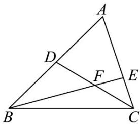
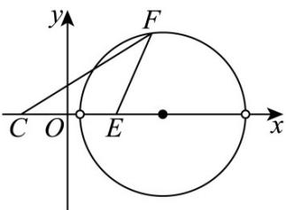

> [!faq]- 《第二章+直线和圆的方程（高效培优单元测试·提升卷）》官方解析
>
> > [!success]- **【答案】** $12 \sqrt{3}$
>
> > [!note]- **【解析】**
> > 在VABC中，D是AB的中点，E在边AC上，AE=2EC，
> >
> > $$
> > \begin{array}{l} \square \square \square \\ B E = \square B C + \square C E = \square B C + \frac {1}{3} \square C A = \frac {1}{3} \square B A + \frac {2}{3} \square B C = \frac {2}{3} \square B D + \frac {2}{3} \square B C, \text {令} B E = \lambda B F, \end{array}
> > $$
> >
> > 则 $\overline{BF}=\frac{2}{3\lambda}\overline{BD}+\frac{2}{3\lambda}\overline{BC}$ ，又点 C,F,D 共线，于是 $\frac{2}{3\lambda}+\frac{2}{3\lambda}=1$ ，解得 $\lambda=\frac{4}{3}$ ，
> >
> > 则 $FE=\frac{1}{3}FB=\frac{\sqrt{3}}{3}FC$ ，VABC 的面积 $S_{\triangle ABC}=3S_{\triangle BCE}=12S_{\triangle FCE}$
> >
> > 
> >
> > 由 $AC = 6$ ，得 $CE = 2$ ，以直线 $CE$ 为 $x$ 轴，线段 $CE$ 的中垂线为 $y$ 轴建立平面直角坐标系，
> >
> > 点 $C(-1,0)$ , $E(1,0)$ ，设 $F(x,y)$ ，则 $3(x-1)^{2}+3y^{2}=(x+1)^{2}+y^{2}$
> >
> > 整理得 $(x - 2)^{2} + y^{2} = 3$ ，因此点 $F$ 的轨迹是以(2,0)为圆心， $\sqrt{3}$ 为半径的圆（除圆与 $x$ 轴的交点外），
> >
> > 
> >
> > 则点 F 到边 AC 的距离的最大值为 $\sqrt{3}$ ，
> >
> > 所以 VABC 的面积的最大值为 $12 \times \frac{1}{2} \times 2 \times \sqrt{3} = 12\sqrt{3}$
> >
> > 故答案为： $12\sqrt{3}$
> >
> > 四、解答题：本题共5小题，共77分。解答应写出文字说明、证明过程或演算步骤。
