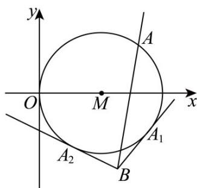

> [!faq]- 《第二章+直线和圆的方程（高效培优单元测试·提升卷）》官方解析
>
> > [!success]- **【答案】** (1) $(x-4)^{2}+y^{2}=16$ . (2) $x = 1$ 或 $4x - 3y - 1 = 0$ . (3) $\left(-\infty, \frac{5 - 4\sqrt{10}}{15}\right] \cup \left[\frac{5 + 4\sqrt{10}}{15}, +\infty\right)$ .
>
> > [!note]- **【解析】**
> > （1）设圆心 $M$ 的坐标为 $(a,0)$ ，已知圆 $M$ 与直线 $3x - \sqrt{7} y + 4 = 0$ 相切于点 $(1,\sqrt{7})$ ，则直线 $MM_{1}$ （ $M_{1}(1,\sqrt{7})$ ）与直线 $3x - \sqrt{7} y + 4 = 0$ 垂直。
> >
> > 直线 $3x - \sqrt{7} y + 4 = 0$ 的斜率 $k_{1} = \frac{3}{\sqrt{7}}$ ，可得直线 $MM_{1}$ 的斜率 $k_{MM_1} = \frac{\sqrt{7} - 0}{1 - a} = -\frac{\sqrt{7}}{3}$
> >
> > 即 $\frac{\sqrt{7}}{1 - a} = -\frac{\sqrt{7}}{3}$ ，解得 $a = 4$ ，所以圆心 $M(4,0)$
> >
> > 圆 M 的半径 $r = \sqrt{(4 - 1)^{2} + (0 - \sqrt{7})^{2}} = \sqrt{9 + 7} = 4$ .
> >
> > 则圆 M 的标准方程为 $(x-4)^{2}+y^{2}=16$ .
> >
> > (2) 当直线 l 的斜率不存在时，直线 l 的方程为 x=1 ，此时圆心 M 到直线 l 的距离 d=4-1=3 .
> >
> > 根据垂径定理 $\left|PQ\right|=2\sqrt{r^{2}-d^{2}}=2\sqrt{16-9}=2\sqrt{7}$ ，满足题意
> >
> > 当直线 l 的斜率存在时，设直线 l 的方程为 $y-1=k(x-1)$ ，即 $kx-y-k+1=0$ 。
> >
> > 圆心 $M(4,0)$ 到直线 $l$ 的距离 $d = \frac{|4k - 0 - k + 1|}{\sqrt{k^2 + 1}} = \frac{|3k + 1|}{\sqrt{k^2 + 1}}.$
> >
> > 由垂径定理可得 $|PQ| = 2\sqrt{r^2 - d^2} = 2\sqrt{16 - \left(\frac{|3k + 1|}{\sqrt{k^2 + 1}}\right)^2} = 2\sqrt{7}$
> >
> > 即 $16 - \left(\frac{|3k + 1|}{\sqrt{k^2 + 1}}\right)^2 = 7$ ， $\frac{(3k + 1)^2}{k^2 + 1} = 9$ ， $(3k + 1)^2 = 9(k^2 + 1)$ ，解得 $k = \frac{4}{3}$
> >
> > 则直线 l 的方程为 $y-1=\frac{4}{3}(x-1)$ ，即 4x-3y-1=0。
> >
> > 综上，直线 l 的一般式方程为 x=1 或 4x-3y-1=0。
> >
> > (3) 设 $\frac{y+5}{x-5}=k$ ，则 $y+5=k(x-5)$ ，即 kx-y-5k-5=0。
> >
> > $\frac{y + 5}{x - 5}$ 的几何意义是圆 $M$ 上的点 $A(x,y)$ 与点 $B(5, - 5)$ 连线的斜率
> >
> > 当直线 $kx - y - 5k - 5 = 0$ 与圆 $M$ 相切时，圆心 $M(4,0)$ 到直线的距离 $d = \frac{|4k - 0 - 5k - 5|}{\sqrt{k^2 + 1}} = r = 4$ ，即
> >
> > $$
> > 1 5 k ^ {2} - 1 0 k - 9 = 0
> > $$
> >
> > $k=\frac{10\pm\sqrt{100+540}}{30}=\frac{5\pm4\sqrt{10}}{15}$ ·由图形知道，
> >
> > 所以 $\frac{y + 5}{x - 5}$ 的取值范围是 $\left(-\infty, \frac{5 - 4\sqrt{10}}{15}\right] \cup \left[\frac{5 + 4\sqrt{10}}{15}, +\infty\right)$ .
> >
> > 
