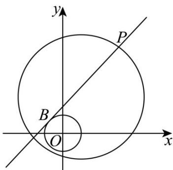

> [!faq]- 《第二章+直线和圆的方程（高效培优单元测试·提升卷）》官方解析
>
> > [!success]- **【答案】** (1) $x = 1$ 和 $x - \sqrt{3} y + 2 = 0$ (2)存在，定点 $N\left(-\frac{1}{5}, - \frac{2}{5}\right)$ ，定值 $\frac{5}{6}$ 或定点 $N(-1, - 2)$ ，定值 $\frac{1}{2}$
>
> > [!note]- **【解析】**
> > （1）当切线斜率不存在时，显然 $x = 1$ 与圆 $O: x^2 + y^2 = 1$ 相切，
> >
> > 当切线斜率存在时，设切线为 $y = k(x - 1) + \sqrt{3}$ ，由圆心到切线的距离为 1，
> >
> > 所以 $\frac{|\sqrt{3} - k|}{\sqrt{1 + k^2}} = 1$ ，解得 $k = \frac{\sqrt{3}}{3}$
> >
> > 则 $y = \frac{\sqrt{3}}{3} (x - 1) + \sqrt{3}$ ，整理得 $x - \sqrt{3} y + 2 = 0$
> >
> > 综上，切线的方程为 $x = 1$ 和 $x - \sqrt{3} y + 2 = 0$ ；
> >
> > (2) 设 $P(x,y)$ ，由 $PA^{2} + PO^{2} = 34$ 得 $(x-2)^{2} + (y-4)^{2} + x^{2} + y^{2} = 34$
> >
> > 即 $x^{2} + y^{2} - 2x - 4y - 7 = 0$
> >
> > 若存在 $N(m,n)$ ，使 $\frac{|PB|^{2}}{|PN|^{2}}=k$ 为定值，
> >
> > $$
> > \left| P B \right| ^ {2} = \left| P O \right| ^ {2} - 1 = x ^ {2} + y ^ {2} - 1 \quad \left| P N \right| ^ {2} = (x - m) ^ {2} + (y - n) ^ {2}
> > $$
> >
> > 则 $x^{2} + y^{2} - 1 = k(x - m)^{2} + k(y - n)^{2}$
> >
> > 整理得 $\left(1 - k\right)\left(x^{2} + y^{2}\right) = k\left(m^{2} + n^{2}\right) - 2mkx - 2nky + 1$
> >
> > 将 $x^{2} + y^{2} = 2x + 4y + 7$ 代入得 $(1 - k)(2x + 4y + 7) = k(m^2 + n^2) - 2mkx - 2nky + 1$
> >
> > 整理得 $\left(2 - 2k + 2mk\right)x + \left(4 - 4k + 2nk\right)y + 6 - 7k - k\left(m^2 +n^2\right) = 0$
> >
> > 要使 $\frac{|PB|^2}{|PN|^2}$ 为定值，则 $\left\{ \begin{array}{l} 1 - k + mk = 0 \\ 2 - 2k + nk = 0 \\ 7k + k(m^2 + n^2) = 6 \end{array} \right.$ ，
> >
> > 解得 $m = -\frac{1}{5}$ ， $n = -\frac{2}{5}$ ， $k = \frac{5}{6}$ 或 $m = -1$ ， $n = -2$ ， $k = \frac{1}{2}$
> >
> > 综上，存在定点 $N\left(-\frac{1}{5},-\frac{2}{5}\right)$ ，定值 $\frac{5}{6}$ 或定点 $N(-1,-2)$ ，定值 $\frac{1}{2}$
> >
> > 
