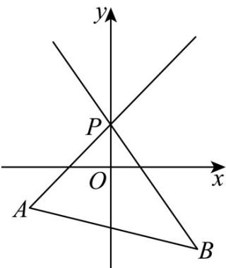

> [!faq]- 《专题2_1_直线的倾斜角与斜率_高效培优讲义_》官方解析
>
> > [!success]- **【答案】** D
>
> > [!note]- **【分析】**
> > 先求出直线 $PA$ 与直线 $PB$ 的斜率，再结合直线 $l$ 与线段 $AB$ 相交的条件，确定直线 $l$ 斜率的取值范围·
>
> > [!note]- **【解析】**
> > 已知 $A(-2,-1)$ ， $P(0,1)$ ，根据过两点直线斜率公式，可得： $k_{PA} = \frac{1 - (-1)}{0 - (-2)} = \frac{2}{2} = 1$ 已知 $B(2,-2)$ ， $P(0,1)$ ，同理可得： $k_{PB} = \frac{1 - (-2)}{0 - 2} = \frac{3}{-2} = -\frac{3}{2}$ 当直线 $l$ 绕点 $P$ 从 $PB$ 位置旋转到与 $y$ 轴重合时，斜率的范围是 $(-∞,-\frac{3}{2}]$ ；
> > 当直线 $l$ 绕点 $P$ 从与 $y$ 轴重合旋转到 $PA$ 位置时，斜率的范围是 $[1,+∞)$ 。
> > 所以直线 $l$ 斜率的取值范围是 $(-∞,-\frac{3}{2}]∪[1,+∞)$ 。
> >
> > 故选：B.
> >
> > 
> >
> > ## 方法技巧
> >
> > 直线的倾斜角是从“形”的角度刻画直线的倾斜程度，而直线的斜率及斜率公式则从“数”的角度刻画直线的倾斜
> > 程度，把二者紧密地结合在一起就是数形结合．利用它可以较为简便地解决一些综合问题，如过定点的直线
> > 与已知线段是否有公共点的问题，可先作出草图，再结合图形考虑．
> >
> > 一般地，若已知 $A(x_{1},y_{1})$ ， $B(x_{2},y_{2})$ ， $P(x_0,y_0)$ ，过 $P$ 点作垂直于 $x$ 轴的直线 $l^{\prime}$ ，过 $P$ 点的任一直线 $l$ 的斜率
> >
> > 为 $k$ ，则当 $l^{\prime}$ 与线段 $AB$ 不相交时， $k$ 夹在 $k_{PA}$ 与 $k_{PB}$ 之间；当 $l^{\prime}$ 与线段 $AB$ 相交时， $k$ 在 $k_{PA}$ 与 $k_{PB}$ 的两边。
