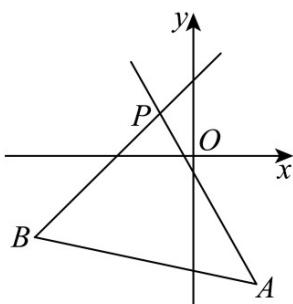

> [!faq]- 《专题2_1_直线的倾斜角与斜率_高效培优讲义_》官方解析
>
> > [!success]- **【答案】** B 利用直线的斜率公式即可求解·
>
> > [!note]- **【解析】**
> > 由 $mx - y + m + 1 = 0$ ，得 $y - 1 = m(x + 1)$
> >
> > 所以直线 l 的方程恒过定点 $P(-1,1)$ ，斜率为 m。
> >
> > 因为 $A(2, - 3),B(-5, - 2)$
> >
> > 所以 $k_{PA}=\frac{-3-1}{2+1}=-\frac{4}{3},k_{PB}=\frac{-2-1}{-5+1}=\frac{3}{4}$
> >
> > 由题意可知，作出图形如图所示，
> >
> > 
> >
> > 由图象可知， $m = \frac{3}{4}$ 或 $m\leq -\frac{4}{3}$
> >
> > 所以实数 $m$ 的取值范围为 $\left(-\infty, -\frac{4}{3}\right] \cup \left[\frac{3}{4}, +\infty\right)$
> >
> > 故选 **B**.
