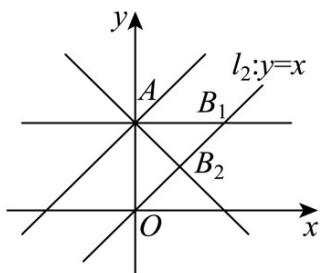

> [!faq]- 《专题2_1_直线的倾斜角与斜率_高效培优讲义_》官方解析
>
> > [!success]- **【答案】** C
>
> > [!note]- **【分析】**
> > 找到三个极端位置的斜率值，并旋转相关直线得到斜率范围·
>
> > [!note]- **【解析】**
> > 当三角形 $OAB$ 为直角三角形时， $OB \perp BA$ 或 $OA \perp BA$ ，此时 $l_{1}$ 的斜率 $k = -1$ 或0.
> > 当 $l_{1}$ 从 $k = -1$ 顺时针旋转到 $y$ 轴之间时，三角形 $OAB$ 为钝角三角形，此时 $k < -1$ ；
> > 当 $l_{1}$ 从 $k = 0$ 逆时针旋转到与直线 $l_{2}: y = x$ 平行之间时，三角形 $OAB$ 为钝角三角形，此时 $0 < k < 1$ ，综上， $k \in (-\infty, -1) \cup (0, 1)$ ，
> >
> > 故选：C.
> >
> > 
> >
> > 故选 **C**.
