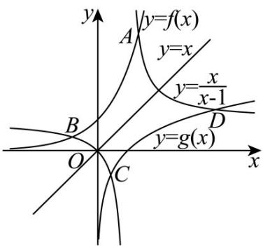

> [!faq]- 《专题2_1_直线的倾斜角与斜率_高效培优讲义_》官方解析
>
> > [!success]- **【答案】** 1
>
> > [!note]- **【分析】**
> > 由题意点A与点D关于直线 $y = x$ 对称，得 $x_{1} = y_{4}, x_{4} = y_{1}$ ，同理 $x_{2} = y_{3}, x_{3} = y_{2}$ ，代入直线的斜率公
> >
> > 式化简即可求解·
>
> > [!note]- **【解析】**
> > 设 $A(x_{1},y_{1}),B(x_{2},y_{2}),C(x_{3},y_{3}),D(x_{4},y_{4})$ ，则 $y_{1} = \mathrm{e}^{x_{1}},y_{2} = \mathrm{e}^{x_{2}},y_{3} = \ln x_{3},y_{4} = \ln x_{4}$
> >
> > 由点A与点D关于直线 $y = x$ 对称，所以 $x_{1} = y_{4}, x_{4} = y_{1}$ ，同理 $x_{2} = y_{3}, x_{3} = y_{2}$
> >
> > 所以 $y_{1}=\frac{x_{1}}{x_{1}-1},y_{2}=\frac{x_{2}}{x_{2}-1},y_{3}=\frac{x_{3}}{x_{3}-1},y_{4}=\frac{x_{4}}{x_{4}-1}$
> >
> > 因为 $k_{AC}=\frac{y_{3}-y_{4}}{x_{3}-x_{4}},k_{BD}=\frac{y_{4}-y_{2}}{x_{4}-x_{2}}$
> >
> > $$
> > k _ {A C} k _ {B D} = \frac {y _ {3} - y _ {1}}{x _ {3} - x _ {1}} \cdot \frac {y _ {4} - y _ {2}}{x _ {4} - x _ {2}} = \frac {\frac {x _ {3}}{x _ {3} - 1} - \frac {x _ {1}}{x _ {1} - 1}}{x _ {3} - x _ {1}} \cdot \frac {\frac {x _ {4}}{x _ {4} - 1} - \frac {x _ {2}}{x _ {2} - 1}}{x _ {4} - x _ {2}} = \frac {1}{(x _ {3} - 1) (x _ {1} - 1)} \cdot \frac {1}{(x _ {4} - 1) (x _ {2} - 1)} = \frac {y _ {1} y _ {2} y _ {3} y _ {4}}{x _ {1} x _ {2} x _ {3} x _ {4}} = 1
> > $$
> >
> > 故答案为：1.
> >
> > 
