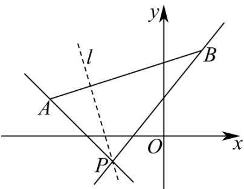

> [!faq]- 《专题2_1_直线的倾斜角与斜率_高效培优讲义_》官方解析
>
> > [!success]- **【答案】** $\left(-\infty,-\frac{3}{2}\right]\cup\left[\frac{4}{3},+\infty\right)$
>
> > [!note]- **【分析】**
> > 根据斜率公式求出 $k_{PA}, k_{PB}$ ，再结合图形求出直线 $^{1}$ 的斜率的取值范围·
>
> > [!note]- **【解析】**
> > 根据题中条件画出图形，如图所示，
> >
> > 
> >
> > 因为 $P(-2, - 1)$ ， $A(-4,2)$ ， $B(1,3)$ ，设直线 $l$ 的斜率为 $k$
> >
> > 则 $k_{PA} = \frac{2 - (-1)}{-4 - (-2)} = -\frac{3}{2}, k_{PB} = \frac{3 - (-1)}{1 - (-2)} = \frac{4}{3}$
> >
> > 直线 $l$ 与以 $AB$ 为端点的线段相交，结合图形，
> >
> > 则直线 l 的斜率的取值范围为 $\left(-\infty, -\frac{3}{2}\right] \cup \left[\frac{4}{3}, +\infty\right)$ .
> >
> > 故答案为： $\left(-\infty,-\frac{3}{2}\right]\cup\left[\frac{4}{3},+\infty\right)$
