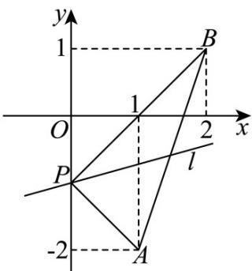

> [!faq]- 《专题2_1_直线的倾斜角与斜率_高效培优讲义_》官方解析
>
> > [!success]- **【答案】** D
>
> > [!note]- **【分析】**
> > 先求出直线 $l$ 所过定点 $P$ 的坐标，数形结合可求出直线 $l$ 的斜率的取值范围，即可得出直线 $l$ 的倾斜
> >
> > 角的取值范围.
>
> > [!note]- **【解析】**
> > 直线 l 的方程可化为 $m(x+y+1)+(2x-y-1)=0$ ，由 $\left\{\begin{aligned}x+y+1&=0\\ 2x-y&=0\end{aligned}\right.$ ，可得 $\left\{\begin{aligned}x&=0\\ y&=-1\end{aligned}\right.$
> >
> > 所以，直线 l 过定点 $P(0,-1)$ ，
> >
> > 设直线 l 的斜率为 k ，直线 l 的倾斜角为 $\alpha$ ，则 $0 \leq \alpha < \pi$
> >
> > 因为直线 $PA$ 的斜率为 $\frac{-1 - (-2)}{0 - 1} = -1$ ，直线 $PB$ 的斜率为 $\frac{-1 - 1}{0 - 2} = 1$
> >
> > 因为直线 l 经过点 $P(0,-1)$ ，且与线段 AB 总有公共点，
> >
> > 
> >
> > 将 $A(1, -2)$ 代入方程： $(m + 2)x + (m - 1)y + m - 1 = 0$
> >
> > 可得：3=0 不成立， $A(1,-2)$ 不在直线 l 上，
> >
> > 所以 $-1 < k \leq 1$ ，即 $-1 < \tan \alpha \leq 1$
> >
> > 因为 $0 \leq \alpha < \pi$ 所以 $0 \leq \alpha \leq \frac{\pi}{4}$ 或 $\frac{3\pi}{4} < \alpha < \pi$
> >
> > 故直线 $l$ 的倾斜角的取值范围是 $\left[0, \frac{\pi}{4}\right] \cup \left(\frac{3\pi}{4}, \pi\right)$
> >
> > 故选 **D**.
