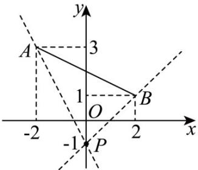

## 题型03 已知两点求斜率、已知斜率求参数

【典例1】已知 $A(-2,3)$ 、 $B(2,1)$ ，若斜率存在的直线 $l$ 经过点 $P(0,-1)$ ，且与线段 $AB$ 有交点，则 $l$ 的斜率的取值范围为（）A. $[-2,1]$ B. $[-1,2]$ C. $(-∞,-2]∪[1,+∞)$ D. $(-∞,-1]∪[2,+∞)$

【答案】C

【分析】先利用直线的斜率公式计算 $k_{PA}$ ， $k_{PB}$ ；再结合图形，利用直线与线段有交点的条件建立不等式，即

可得出结果·

【详解】由直线的斜率公式可得：

$$
k _ {P A} = \frac {3 - (- 1)}{- 2 - 0} = - 2, k _ {P B} = \frac {1 - (- 1)}{2 - 0} = 1.
$$

结合图形，要使直线 l 经过点 $P(0,-1)$ ，且与线段 AB 有交点，l 的斜率需满足 $k \leq -2$ 或 k = 1.

故选：C.

## 方法技巧

由于直线上任意两点的斜率都相等，因此 $A, B, C$ 三点共线 $\Leftrightarrow A, B, C$ 中任意两点的斜率相等（如 $k_{AB} = k_{AC}$ ）。

斜率是反映直线相对于 $x$ 轴正方向的倾斜程度的，直线上任意两点所确定的方向不变，即在同一直线上任意

不同的两点所确定的斜率相等．这正是利用斜率可证三点共线的原因．

![[高中/课堂同步/题库/人教A版高中数学同步讲义(2026)/03_选择性必修第一册/第二章 直线和圆的方程/讲义/专题2_1_直线的倾斜角与斜率_高效培优讲义_/_compact/Q00063394.md]]
![[高中/课堂同步/题库/人教A版高中数学同步讲义(2026)/03_选择性必修第一册/第二章 直线和圆的方程/讲义/专题2_1_直线的倾斜角与斜率_高效培优讲义_/_compact/Q00063395.md]]
![[高中/课堂同步/题库/人教A版高中数学同步讲义(2026)/03_选择性必修第一册/第二章 直线和圆的方程/讲义/专题2_1_直线的倾斜角与斜率_高效培优讲义_/_compact/Q00063396.md]]
![[高中/课堂同步/题库/人教A版高中数学同步讲义(2026)/03_选择性必修第一册/第二章 直线和圆的方程/讲义/专题2_1_直线的倾斜角与斜率_高效培优讲义_/_compact/Q00063397.md]]
![[高中/课堂同步/题库/人教A版高中数学同步讲义(2026)/03_选择性必修第一册/第二章 直线和圆的方程/讲义/专题2_1_直线的倾斜角与斜率_高效培优讲义_/_compact/Q00063398.md]]
![[高中/课堂同步/题库/人教A版高中数学同步讲义(2026)/03_选择性必修第一册/第二章 直线和圆的方程/讲义/专题2_1_直线的倾斜角与斜率_高效培优讲义_/_compact/Q00063399.md]]
