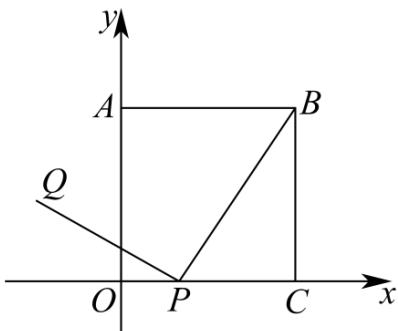

## 题型07 直线平行、垂直在几何问题的应用

【典例1】如图，正方形 $OABC$ 的一个顶点 $O$ 是平面直角坐标系的原点，顶点 $A$ ， $C$ 分别在 $y$ 轴和 $x$ 轴上， $P$

为边 $OC$ 上的一个动点，且 $BP \perp PQ$ ， $BP = PQ$ ，当点 $P$ 从点 $C$ 运动到点 $O$ 时，可知点 $Q$ 始终在某函数图

象上运动，则其函数图象是（）

A. 线段 B. 圆弧 C. 抛物线的一部分 D. 不同于以上的不规则曲线

【答案】A

【分析】首先设正方形OABC的边长是a，则点B的坐标是 $(a,a)$ ，设点Q的坐标是 $(x,y)$ ，点P的坐标是 $(b,0)(0\leq b\leq a)$ ；然后根据 $BP\perp PQ,\quad BP=PQ$ ，推得y=a-b，再根据 $0\leq b\leq a$ ，可得 $0\leq y\leq a$ ，所以其函数

图象是线段·

【详解】设正方形 OABC 的边长是 a，则点 B 的坐标是 $(a, a)$

设点 $Q$ 的坐标是 $(x, y)$ ，点 $P$ 的坐标是 $(b, 0), (0 \leq b \leq a)$

$$
\because P Q \perp B P
$$

$$
\therefore \frac {y}{x - b} \times \frac {a}{a - b} = - 1
$$

$$
\therefore (x - b) ^ {2} = \frac {a ^ {2} y ^ {2}}{(a - b) ^ {2}} \tag {①}
$$

$$
\because P Q = B P
$$

$$
\therefore \sqrt {(x - b) ^ {2} + y ^ {2}} = \sqrt {(a - b) ^ {2} + a ^ {2}}
$$

$$
\therefore (x - b) ^ {2} + y ^ {2} = (a - b) ^ {2} + a ^ {2} \tag {②}
$$

把①代入②，可得 $\frac{a^2y^2}{(a - b)^2} + y^2 = (a - b)^2 + a^2$

整理,可得 $y^{2}=(a-b)^{2}$

$$
\because y > 0 \quad b \leq a
$$

$$
\therefore y = a - b
$$

$$
\because 0 \leq b \leq a
$$

$$
\therefore 0 \leq y \leq a
$$

∴点 Q 在某函数图象上运动，则其函数图象是线段·

故选:A.

## 方法技巧

解决此类问题的关键是充分利用几何图形的几何性质，并用解析几何中的相关知识解决。

![[高中/课堂同步/题库/人教A版高中数学同步讲义(2026)/03_选择性必修第一册/第二章 直线和圆的方程/讲义/专题2_1_直线的倾斜角与斜率_高效培优讲义_/_compact/Q00063406.md]]
![[高中/课堂同步/题库/人教A版高中数学同步讲义(2026)/03_选择性必修第一册/第二章 直线和圆的方程/讲义/专题2_1_直线的倾斜角与斜率_高效培优讲义_/_compact/Q00063407.md]]
![[高中/课堂同步/题库/人教A版高中数学同步讲义(2026)/03_选择性必修第一册/第二章 直线和圆的方程/讲义/专题2_1_直线的倾斜角与斜率_高效培优讲义_/_compact/Q00063408.md]]
