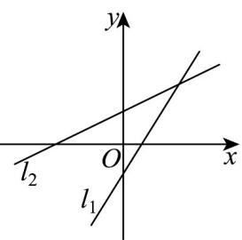
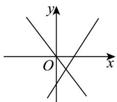
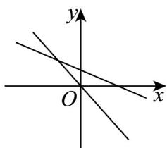

## 知识点 02 直线的斜截式方程

如果直线 $l$ 的斜率为 $k$ ，且与 $y$ 轴的交点为 $(0,b)$ ，根据直线的点斜式方程可得 $y - b = k(x - 0)$ ，即 $y = kx + b$

我们把直线 $l$ 与 $y$ 轴的交点 $(0,b)$ 的纵坐标 $b$ 叫做直线 $l$ 在 $y$ 轴上的截距，方程 $y = kx + b$ 由直线的斜率 $k$ 与它

在 $y$ 轴上的截距 $b$ 确定，所以方程 $y = kx + b$ 叫做直线的斜截式方程，简称斜截式.

【即学即练】

1. 在同一平面直角坐标系中，直线 $l_{1}: y = kx + b$ 和直线 $l_{2}: y = bx + k$ 有可能是（）

A

B

C

D

【答案】B

【分析】根据每个选项中 $l_{1}$ 与 $l_{2}$ 的图象，分别确定k,b的取值即可判断.

【详解】对于 $\mathsf{A}$ ，直线 $l_{1}:y = kx + b$ 单调递减， $l_{1}$ 与 $y$ 轴交于正半轴，则 $k <   0,b > 0$

直线 $l_{2}: y = bx + k$ 单调递减， $l_{2}$ 与 y 轴交于负半轴，则 b < 0, k < 0，不成立，故 A 错误；

对于 B，直线 $l_{1}: y = kx + b$ 单调递减， $l_{1}$ 与 y 轴交于负半轴，则 k < 0, b < 0

直线 $l_{2}: y = bx + k$ 单调递减， $l_{2}$ 与 y 轴交于负半轴，则 b < 0, k < 0 ，成立，故 B 正确；

对于 $\mathbb{C}$ ，直线 $l_{1}:y = kx + b$ 单调递增， $l_{1}$ 与 $y$ 轴交于负半轴，则 $k > 0,b <   0$

直线 $l_{2}: y = bx + k$ 单调递增， $l_{2}$ 与 y 轴交于正半轴，则 b > 0, k > 0 ，不成立，故 C 错误；

对于 D，直线 $l_{1}: y = kx + b$ 单调递增， $l_{1}$ 与 y 轴交于正半轴，则 k > 0, b > 0

直线 $l_{2}: y = bx + k$ 单调递减， $l_{2}$ 与 y 轴交于正半轴，则 b < 0, k > 0 ，不成立，故 D 错误；

故选：B.

2. 如图，在同一直角坐标系中，表示直线 $y = x + a$ 与 $y = ax$ 正确的是（）

A

B

C

D

【答案】C

【分析】由 $y = x + a$ 与 y = ax 中 a 同号，分类讨论 y = ax 递增与 y = ax 递减，得到结果.

【详解】当 $a > 0$ 时，直线 $y = ax$ 过原点，且单调递增，

直线 $y = x + a$ 单调递增，且纵截距为正数，

没有符合的图象。

当 a < 0 时，直线 y = ax 过原点，且单调递减，

直线 $y = x + a$ 单调递增，且纵截距为负数，

C 选项符合.

故选：C
