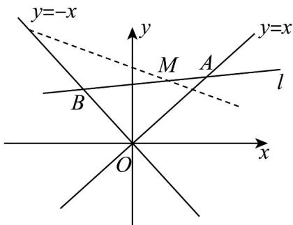

> [!faq]- 《专题2_2_直线的方程_高效培优讲义_》官方解析
>
> > [!success]- **【答案】** A
>
> > [!note]- **【分析】**
> > 判断直线斜率存在并设直线 $l$ 的方程为 $y - 3 = k(x - 1)$ ，求出 $A, B$ 两点的横坐标，表示出三角形的面
> >
> > 积，并化简，结合基本不等式即可求得答案·
>
> > [!note]- **【解析】**
> > 由题意知直线 l 的斜率一定存在，斜率设为 k，则直线 l 的方程为 $y - 3 = k(x - 1)$ ，
> >
> > 分别与 y = x, y = -x 联立可得 A, B 两点的横坐标： $x_{A} = \frac{3 - k}{1 - k}, x_{B} = \frac{k - 3}{k + 1}$
> >
> > 故 $S_{\triangle AOB} = \frac{1}{2}\cdot \sqrt{2}\left|x_A\right|\cdot \sqrt{2}\left|x_B\right| = \left|x_Ax_B\right| = \left|\frac{3 - k}{1 - k}\cdot \frac{k - 3}{k + 1}\right|$ ， $A,B$ 两点都在 $x$ 轴的上方，
> >
> > 故 $-1 < k < 1$
> >
> > 
> >
> > $$
> > S _ {\triangle A O B} = \frac {3 - k}{k + 1} \cdot \frac {3 - k}{1 - k} = \left[ 1 + \frac {2 (1 - k)}{k + 1} \right] \cdot \left[ 2 + \frac {1 + k}{1 - k} \right] = 4 + \frac {4 (1 - k)}{k + 1} + \frac {1 + k}{1 - k} \quad 4 + 2 \sqrt {\frac {4 (1 - k)}{k + 1} \cdot \frac {1 + k}{1 - k}} = 8
> > $$
> >
> > 当且仅当 $\frac{4(1-k)}{k+1}=\frac{1+k}{1-k}$ ，即 $k=\frac{1}{3}$ 时等号成立，
> >
> > 故VAOB面积的最小值为8，
> >
> > 故选 **A**.
