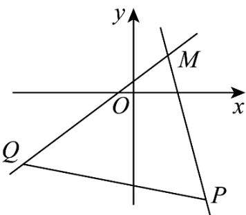

## 题型01 点斜式直线方程

【典例1】已知两点 $M(a6), N(a + 23)$ ，以下各点一定在直线 $MN$ 上的是（）A. $(a + 40)$ B. $(a + 42)$ C. $(a + 44)$ D. $(a + 46)$

【答案】A

【分析】利用两点可求出直线 MN 的斜率 $k_{MN}$ ，再利用点斜式写出直线 MN 的方程，最后代入 $x = a + 4$ 即可得

解·

【详解】因为 $M(a,6)$ ， $N(a + 2,3)$

所以 $k_{MN}=\frac{3-6}{a+2-a}=-\frac{3}{2}$

所以直线 $MN$ 的方程为： $y - 6 = -\frac{3}{2} (x - a)$

即 $y = -\frac{3}{2} x + \frac{3}{2} a + 6$

当 $x = a + 4$ 时， $y = -\frac{3}{2} (a + 4) + \frac{3}{2} a + 6 = -\frac{3}{2} a - 6 + \frac{3}{2} a + 6 = 0$

所以点 $(a+4,0)$ 在直线MN上.

故选：A.

## 方法技巧

（1）利用点斜式求直线方程的步骤是：①判断斜率 $k$ 是否存在，并求出存在时的斜率；②在直线上找一点，并求出其坐标．

(2) 要注意点斜式直线方程的逆向运用，即由方程 $y - y_0 = k(x - x_0)$ 可知该直线过定点 $P(x_0, y_0)$ 且斜率为 $k$ 【变式1】已知点 $P(2, -3), Q(-3, -2)$ ，直线 $y = kx - k + 1$ 与线段 $PQ$ 相交，则实数 $k$ 的取值范围是（）

A. $(-\infty, -4] \cup \left[\frac{3}{4}, +\infty\right)$ B. $\left[-4, \frac{3}{4}\right]$ C. $\left[-\frac{3}{4}, 4\right]$ D. $\left(-\infty, -\frac{3}{4}\right] \cup [4, +\infty)$

【答案】A

【分析】由直线 $y = kx - k + 1$ 恒过定点 $M(1,1)$ ，分别计算 $k_{MP}, k_{MQ}$ ，结合图象即可得 $k$ 的范围·

【详解】直线 $y = kx - k + 1$ 经过定点 $M(1,1)$ ，如图所示，

则 $k_{MP} = \frac{-3 - 1}{2 - 1} = -4, k_{MQ} = \frac{-2 - 1}{-3 - 1} = \frac{3}{4}$

因为直线 $y = kx - k + 1$ 与线段 $PQ$ 相交，

$$
k \in (- \infty , - 4 ] \cup [ \frac {3}{4}, + \infty)
$$

所以由图可知

故答案为：

$$
(- \infty , - 4 ] \cup [ \frac {3}{4}, + \infty)
$$

![[高中/课堂同步/题库/人教A版高中数学同步讲义(2026)/03_选择性必修第一册/第二章 直线和圆的方程/讲义/专题2_2_直线的方程_高效培优讲义_/题型01_点斜式直线方程_sec_14/questions/Q00063426.md]]
![[高中/课堂同步/题库/人教A版高中数学同步讲义(2026)/03_选择性必修第一册/第二章 直线和圆的方程/讲义/专题2_2_直线的方程_高效培优讲义_/题型01_点斜式直线方程_sec_14/questions/Q00063427.md]]
