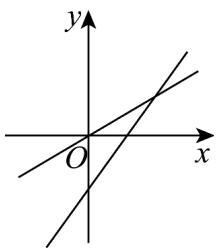
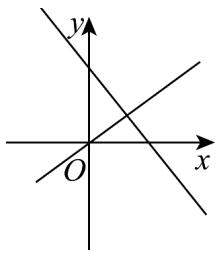
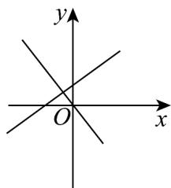

## 题型02 斜截式直线方程

【典例1】一次函数 $l_{2}: y = kx + b$ 与 $l_{1}: y = kbx(k, b$ 为常数，且 $kb \neq 0$ ，它们在同一坐标系内的图象可能为

( )

A

B

C

D

【答案】C

【分析】根据图象分析 b、k 取值符号进行判断即可．

【详解】对于选项 A 中，直线 $l_{1}$ 的 kb > 0，直线 $l_{2}$ 的 k > 0, b < 0, kb < 0. A 错；

对于选项 B 中，直线 $l_{1}$ 的 kb > 0，直线 $l_{2}$ 的 k < 0, b > 0, kb < 0，∴ B 错；

对于选项 C 中，直线 $l_{1}$ 的 kb < 0，直线 $l_{2}$ 的 k < 0, b > 0, kb < 0。C 对；

对于选项 D 中，直线 $l_{1}$ 的 kb < 0，直线 $l_{2}$ 的 k > 0, b > 0, kb > 0 ∴ D 错。

故选：C.

## 方法技巧

(1) 选用斜截式表示直线方程的依据是知道（或可以求出）直线的斜率 $k$ 和直线在 $y$ 轴上的截距 $b$

(2) 直线的斜截式方程的好处在于它比点斜式方程少一个参数，即斜截式方程只要两个参数 $k$ 、 $b$ 即可确定

直线的方程，而点斜式方程则需要三个参数 $k$ 、 $x_0$ 、 $y_0$ 才能确定，而且它的形式简洁明了，这样当我们仅知

道直线满足一个条件时，由参数选用斜截式方程具有化繁为简的作用。

（3）若直线过某一点，则这一点坐标一定满足直线方程，这一隐含条件应充分利用。

![[高中/课堂同步/题库/人教A版高中数学同步讲义(2026)/03_选择性必修第一册/第二章 直线和圆的方程/讲义/专题2_2_直线的方程_高效培优讲义_/题型02_斜截式直线方程_sec_15/questions/Q00063428.md]]
![[高中/课堂同步/题库/人教A版高中数学同步讲义(2026)/03_选择性必修第一册/第二章 直线和圆的方程/讲义/专题2_2_直线的方程_高效培优讲义_/题型02_斜截式直线方程_sec_15/questions/Q00063429.md]]
![[高中/课堂同步/题库/人教A版高中数学同步讲义(2026)/03_选择性必修第一册/第二章 直线和圆的方程/讲义/专题2_2_直线的方程_高效培优讲义_/题型02_斜截式直线方程_sec_15/questions/Q00063430.md]]
