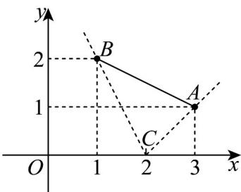

> [!faq]- 《专题2_2_直线的方程_高效培优讲义_》官方解析
>
> > [!success]- **【答案】** A
>
> > [!note]- **【分析】**
> > 根据条件得直线 $x + ay - 2 = 0$ 过点 $C(2,0)$ ，再数形结合，即可求解.
>
> > [!note]- **【解析】**
> > 直线 $x + ay - 2 = 0$ 过点 $C(2,0)$ ，画出图象如下图所示， $k_{BC} = \frac{2 - 0}{1 - 2} = -2, k_{AC} = \frac{1 - 0}{3 - 2} = 1$
> >
> > 由于直线 $x + ay - 2 = 0$ 与线段 $AB$ 没有公共点，当 $a = 0$ 时，直线 $x = 2$ 与线段 $AB$ 有公共点，不符合题意，当 $a \neq 0$ 时，直线 $x + ay - 2 = 0$ 的斜率为 $-\frac{1}{a}$ ，
> >
> > 根据图象可知 $-\frac{1}{a}$ 的取值范围是 $(-2,0)\cup(0,1)$ ，所以 a 的取值范围是 $(-∞,-1)\cup\left(\frac{1}{2},+∞\right)$ .
> >
> > 
> >
> > 故选 **A**.
