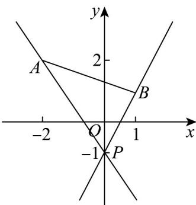

> [!faq]- 《专题2_2_直线的方程_高效培优讲义_》官方解析
>
> > [!success]- **【答案】** C
>
> > [!note]- **【分析】**
> > 直线 $ax + y + 1 = 0$ 恒过定点 $P(0, - 1)$ ，若直线 $ax + y + 1 = 0$ 与线段 $AB$ 有交点，画图图形，求出临界时
> >
> > 直线 PA 的斜率与直线 PB 的斜率，即可得解·
>
> > [!note]- **【解析】**
> > 由 $ax + y + 1 = 0$ 得 y = -ax - 1
> >
> > 因此直线 $l: ax + y + 1 = 0$ 过定点 $P(0, -1)$ ，且斜率 k = -a，
> >
> > 如图所示，当直线 $l$ 由直线 $PA$ 按顺时针方向旋转到直线 $PB$ 的位置时，符合题意。
> >
> > 
> >
> > 易得 $k_{PB} = \frac{1 - (-1)}{1 - 0} = 2$ ， $k_{PA} = \frac{2 - (-1)}{-2 - 0} = -\frac{3}{2}$
> >
> > 结合图形知 $-a$ 2或 $-a\leq -\frac{3}{2}$ ，解得 $a\leq -2$ 或 $a = \frac{3}{2}$
> >
> > 即 $a$ 的取值范围是 $(- \infty, -2] \cup \left[\frac{3}{2}, +\infty\right)$
> >
> > 故选 **C**
