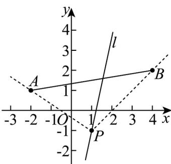

> [!faq]- 《专题2_2_直线的方程_高效培优讲义_》官方解析
>
> > [!success]- **【答案】** D
>
> > [!note]- **【分析】**
> > 根据直线方程可得直线 l 经过定点 $P(1,-1)$ 。根据直线 $l:ax+y-a+1=0$ 与线段 AB 相交，结合图形则
> >
> > 可得直线 $l$ 的斜率取值范围.
>
> > [!note]- **【解析】**
> > 直线 $l: ax + y - a + 1 = 0$ ，即 $a(x - 1) + y + 1 = 0$ ，令 $\left\{ \begin{array}{l} x - 1 = 0 \\ y + 1 = 0 \end{array} \right.$ ，可得直线 $l$ 经过定点 $P(1, -1)$ ，
> >
> > 又 $k_{PA} = \frac{-1 - 1}{1 - (-2)} = -\frac{2}{3}, k_{PB} = \frac{-1 - 2}{1 - 4} = 1$
> >
> > 直线 $l: ax + y - a + 1 = 0$ 与线段 AB 相交，
> >
> > 
> >
> > 由图可得，则直线 $l$ 的斜率取值范围是 $\left(-\infty, -\frac{2}{3}\right] \cup [1, +\infty)$
> >
> > 故选 **D**.
