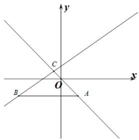

## 题型08 判断动直线所过定点

【典例1】已知点 $A(2, - 2)$ ， $B(-5, - 2)$ ，若直线 $l:mx + y + m - 1 = 0$ 与线段 $AB$ （含端点）有公共点，则实数 $m$ 的取值范围为（ ）A. $\left[-1,\frac{3}{4}\right]$ B. $(-\infty , - 1]\cup \left[\frac{3}{4}, + \infty\right)$ C. $\left[-\frac{3}{4},1\right]$ D. $\left(-\infty , - \frac{3}{4}\right]\cup [1, + \infty)$

【答案】D

【分析】先求出直线 $l$ 的定点，再结合直线的斜率公式，即可求解.

【详解】直线 $l: mx + y + m - 1 = 0$ ，即 $m(x + 1) + y - 1 = 0$

则直线 l 过定点 $C(-1,1)$

$$
\therefore k _ {A C} = \frac {- 2 - 1}{2 + 1} = - 1, k _ {B C} = \frac {- 2 - 1}{- 5 + 1} = \frac {3}{4}
$$

$\because$ 直线 $l:mx+y+m-1=0$ 与线段AB（含端点）有公共点，
∴ -m $\frac{3}{4}$ 或 $-m \leq -1$ ，解得 $m \leq -\frac{3}{4}$ 或 m 1，

故实数 $m$ 的取值范围为 $\left(-\infty, -\frac{3}{4}\right] \cup [1, +\infty)$

故选：D.

## 方法技巧

合并参数，另参数的系数为零解方程.

![[高中/课堂同步/题库/人教A版高中数学同步讲义(2026)/03_选择性必修第一册/第二章 直线和圆的方程/讲义/专题2_2_直线的方程_高效培优讲义_/题型08_判断动直线所过定点_sec_21/questions/Q00063446.md]]
![[高中/课堂同步/题库/人教A版高中数学同步讲义(2026)/03_选择性必修第一册/第二章 直线和圆的方程/讲义/专题2_2_直线的方程_高效培优讲义_/题型08_判断动直线所过定点_sec_21/questions/Q00063447.md]]
![[高中/课堂同步/题库/人教A版高中数学同步讲义(2026)/03_选择性必修第一册/第二章 直线和圆的方程/讲义/专题2_2_直线的方程_高效培优讲义_/题型08_判断动直线所过定点_sec_21/questions/Q00063448.md]]
