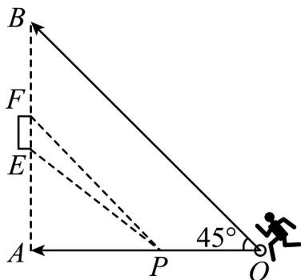

<!-- question-source:start -->
【变式1】足球是一项很受欢迎的体育运动·如图，某标准足球场的 $B$ 底线宽 $AB = 72$ 码，球门宽 $EF = 8$ 码，

球门位于底线的正中位置·在比赛过程中，攻方球员带球运动时，往往需要找到一点 $P$ ，使得 $\angle EPF$ 最大，这

时候点 $P$ 就是最佳射门位置·当攻方球员甲位于边线上的点 $O$ 处（ $OA = AB$ ， $OA \perp AB$ ）时，根据场上形势判

断，有 $OA$ 、 $OB$ 两条进攻线路可供选择·

(1)若选择线路 $OA$ ，则甲带球多少码时，到达最佳射门位置；

(2)若选择线路 $OB$ ，则甲带球多少码时，到达最佳射门位置·
<!-- question-source:end -->

![[高中/课堂同步/题库/人教A版高中数学同步讲义(2026)/03_选择性必修第一册/第二章 直线和圆的方程/讲义/专题2_2_直线的方程_高效培优讲义_/题型10_直线方程的实际应用_sec_23/questions/answers/Q00063452A1.md]]
