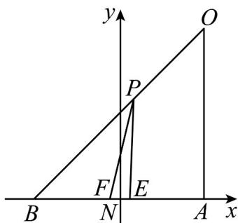

> [!faq]- 《专题2_2_直线的方程_高效培优讲义_》官方解析
>
> > [!success]- **【答案】** (1) $72 - 16\sqrt{5}$ (2) $72\sqrt{2}-16\sqrt{5}$
>
> > [!note]- **【分析】**
> > （1）先由题意表示出 $\tan \angle APE$ ， $\tan \angle APF$ ，然后表示出 $\tan \angle EPF$ ，从而利用基本不等式求出
> >
> > $\tan \angle EPF$ 的最大值，进而得到取得最大值时点 $P$ 的位置；
> >
> > (2) 建立平面直角坐标系，从而利用斜率公式表示出 $\tan \angle AFP$ ， $\tan \angle AEP$ ，然后表示出 $\tan \angle EPF$ ，从而
> >
> > 利用基本不等式求出 $\tan\angle EPF$ 的最大值，进而得到取得最大值时点 P 的位置.
>
> > [!note]- **【解析】**
> > （1）若选择线路OA，设AP=t，其中0<t≤72，AE=32，AF=32+8=40，
> >
> > 则 $\tan \angle APE = \frac{AE}{AP} = \frac{32}{t}$ ， $\tan \angle APF = \frac{AF}{AP} = \frac{40}{t}$
> >
> > $$
> > \tan \angle E P F = \tan (\angle A P F - \angle A P E) = \frac {\tan \angle A P F - \tan \angle A P E}{1 + \tan \angle A P F \tan \angle A P E}
> > $$
> >
> > $$
> > = \frac {\frac {4 0}{t} - \frac {3 2}{t}}{1 + \frac {1 2 8 0}{t ^ {2}}} = \frac {\frac {8}{t}}{1 + \frac {1 2 8 0}{t ^ {2}}} = \frac {8}{t + \frac {1 2 8 0}{t}} \leq \frac {8}{2 \sqrt {t \square \frac {1 2 8 0}{t}}} = \frac {\sqrt {5}}{2 0},
> > $$
> >
> > 当且仅当 $t = \frac{1280}{t}$ 时，即当 $t = 16\sqrt{5}$ 时，等号成立，此时 $OP = OA - AP = 72 - 16\sqrt{5}$ ，
> >
> > 由题意知 $\angle EPF\in \left(0,\frac{\pi}{2}\right)$ ，因为函数 $y = \tan x$ 在 $\left(0,\frac{\pi}{2}\right)$ 上单调递增，
> >
> > 所以 $\tan \angle EPF$ 最大时， $\angle EPF$ 最大，
> >
> > 所以，若选择线路 $OA$ ，则甲带球 $72 - 16\sqrt{5}$ 码时，到达最佳射门位置·
> >
> > (2) 若选择线路 OB，以线段 EF 的中点 N 为坐标原点，BA、AP 的方向分别为 x、y 轴的正方向建立如图
> >
> > 所示的平面直角坐标系，
> >
> > 
> >
> > 则 $B(-36,0)$ ， $O(36,72)$ ， $F(-4,0)$ ， $E(4,0)$
> >
> > 则 $k_{OB} = \frac{72}{36 + 36} = 1$ ，直线 $OB$ 的方程为 $y = x + 36$
> >
> > 设点 $P(x,x+36)$ ，其中 $-36<x\leq36$ ，
> >
> > $\tan \angle AFP = k_{PF} = \frac{x + 36}{x + 4}$ ， $\tan \angle AEP = k_{PE} = \frac{x + 36}{x - 4}$
> >
> > 所以 $\tan\angle EPF = \tan(\angle AEP - \angle AFP) = \frac{\tan\angle AEP - \tan\angle AFP}{1 + \tan\angle AEP \tan\angle AFP}$
> >
> > $$
> > = \frac {\frac {x + 3 6}{x - 4} - \frac {x + 3 6}{x + 4}}{1 + \frac {x + 3 6}{x - 4} \square \frac {x + 3 6}{x + 4}} = \frac {\frac {8 (x + 3 6)}{x ^ {2} - 1 6}}{1 + \frac {(x + 3 6) ^ {2}}{x ^ {2} - 1 6}} = \frac {8}{(x + 3 6) + \frac {x ^ {2} - 1 6}{x + 3 6}},
> > $$
> >
> > 令 $m = x + 36 \in (0,72]$ ，则 $x = m - 36$ ，
> >
> > 所以 $\left(x+36\right)+\frac{x^{2}-16}{x+36}=m+\frac{\left(m-36\right)^{2}-16}{m}=2m+\frac{1280}{m}-72$ $2\sqrt{2m}\frac{1280}{m}-72=32\sqrt{10}-72$
> >
> > 当且仅当 $2m = \frac{1280}{m}$ ，即 $m = 8\sqrt{10}$ ，即 $x = 8\sqrt{10} -36$ 时，等号成立，
> >
> > 所以 $\tan\angle EPF=\frac{8}{2m+\frac{1280}{m}-72}\leq\frac{8}{32\sqrt{10}-72}=\frac{1}{4\sqrt{10}-9}$
> >
> > 当且仅当 $x = 8\sqrt{10} - 36$ 时，等号成立，此时， $\left|OP\right| = \sqrt{2}\left|36 - \left(8\sqrt{10} - 36\right)\right| = 72\sqrt{2} - 16\sqrt{5}$
> >
> > 由题意知 $\angle EPF\in \left(0,\frac{\pi}{2}\right)$ ，因为函数 $y = \tan x$ 在 $\left(0,\frac{\pi}{2}\right)$ 上单调递增，
> >
> > 所以 $\tan\angle EPF$ 最大时， $\angle EPF$ 最大，
> >
> > 所以，若选择线路 $OB$ ，则甲带球 $72\sqrt{2} - 16\sqrt{5}$ 码时，到达最佳射门位置
