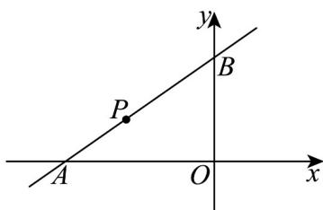

> [!faq]- 《专题2_2_直线的方程_高效培优讲义_》官方解析
>
> > [!success]- **【答案】** (1) $y=-\frac{1}{2}x$ 或 $x-y+3=0$ . (2)最小值为 4， $x-2y+4=0$ .
>
> > [!note]- **【分析】**
> > （1）截距相等时，要考虑到截距为0和不为0两种情况分类讨论；
> >
> > (2) 设直线方程为点斜式，表示直角三角形的面积，通过基本不等式即可求得最值.
>
> > [!note]- **【解析】**
> > （1）当截距为0时，设直线方程为 $y = kx$ ，
> >
> > 因为直线过点 $P(-2,1)$ ，则 1 = -2k，
> >
> > 解得 $k = -\frac{1}{2}$
> >
> > 所以直线方程为 $y = -\frac{1}{2}x$ ;
> >
> > 当截距相等且不为 0 时，设直线方程为 $\frac{x}{a} + \frac{y}{-a} = 1$ ，
> >
> > 因为直线过点 $P(-21)$ ，则代入直线方程得， $a = -3$ ，
> >
> > 则直线方程为 $x - y + 3 = 0$ .
> >
> > 所以直线方程为 $y = -\frac{1}{2}x$ 或 $x - y + 3 = 0$ .
> >
> > (2) 由题意可知，直线的截距不为 0 ，且斜率存在且 k > 0
> >
> > 设直线方程为 $y-1=k(x+2)$
> >
> > 令 $x = 0$ ， $y = 2k + 1$ ；令 $y = 0, x = -\frac{2k + 1}{k}$
> >
> > 
> >
> > 则 $S_{\triangle AOB} = \frac{1}{2}\left|x\right|y = \frac{1}{2}\frac{(2k + 1)^2}{k} = \frac{4k^2 + 4k + 1}{2k} = 2k + \frac{1}{2k} + 2\quad 2\sqrt{2k \times \frac{1}{2k}} + 2 = 4$
> >
> > 当且仅当 $k = \frac{1}{2}$ 时，等号成立·
> >
> > 所以 S 的最小值为 4，此时的直线方程为 $x - 2y + 4 = 0$ .
