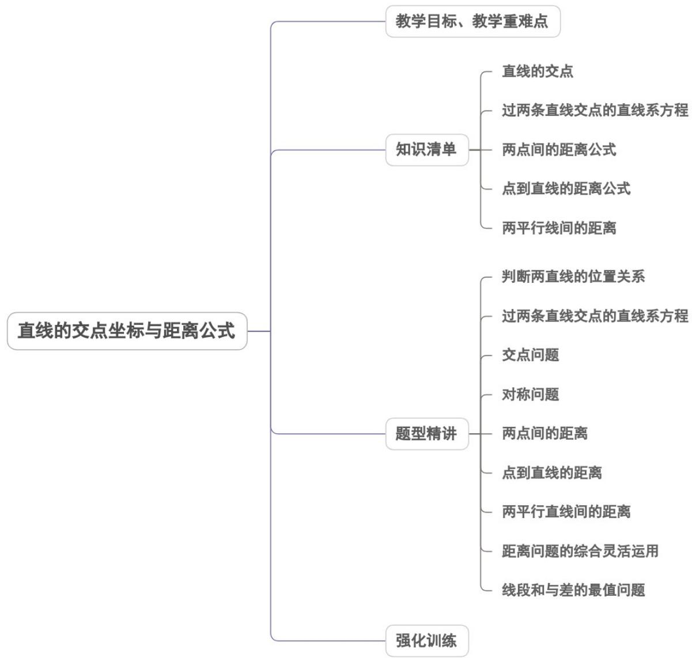

## 专题2.3 直线的交点坐标与距离公式

内容概览

教学目标、教学重难点

<table><tr><td>教学目标</td><td>1.能用解方程组的方法求两直线的交点坐标.2.探索并掌握两点间的距离公式.3.探索并掌握点到直线的距离公式.4.会求两条平行直线间的距离.</td></tr><tr><td>教学重难点</td><td>1.重点掌握点到直线的距离公式.2.难点直线的恒过定点问题</td></tr></table>
