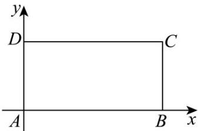

<!-- question-source:start -->
15. 在平面直角坐标系中，已知矩形 $ABCD$ 的长 $\left|AB\right| = 2$ ，宽 $\left|AD\right| = 1$ ， $AB$ 、 $AD$ 边分别在 $x$ 轴、 $y$ 轴的正

半轴上，A点与坐标原点重合，如下图所示·将矩形折叠，使A点落在线段DC上·

(1)若折痕所在直线的斜率为 $k$ ，求折痕所在直线的方程（用斜率 $k$ 表示）；

(2)若折痕和线段 $AB$ 、 $CD$ 相交，求折痕的长的取值范围·
<!-- question-source:end -->

![[高中/课堂同步/题库/人教A版高中数学同步讲义(2026)/03_选择性必修第一册/第二章 直线和圆的方程/讲义/专题2_3_直线的交点坐标与距离公式_高效培优讲义_/强化训练_sec_19/questions/answers/Q00063505A1.md]]
