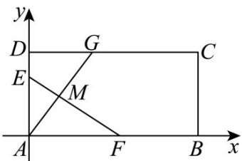
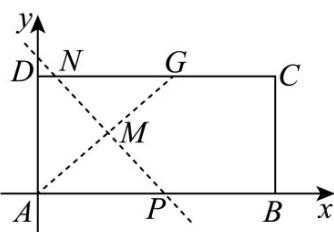

> [!faq]- 《专题2_3_直线的交点坐标与距离公式_高效培优讲义_》官方解析
>
> > [!success]- **【答案】** (1) $y = kx + \frac{k^2 + 1}{2}, (-2 \leq k \leq 0)$ (2) $\left[\frac{\sqrt{5}}{2},\sqrt{2}\right]$
>
> > [!note]- **【分析】**
> > （1）当 $k = 0$ 时，此时A点与 $D$ 点重合，折痕所在的直线方程 $y = \frac{1}{2}$ 。当 $k \neq 0$ 时，将矩形折叠后A
> >
> > 点落在线段 $DC$ 上的点记为 $G(a,1)G(a,1)(0 < a\leq 2)$ ，可知A与 $G$ 关于折痕所在的直线对称，得到 $a = -k$ ，从
> >
> > 而得到 $G$ 点坐标，可得 $AG$ 中点 $M$ 的坐标，利用点斜式求得折痕所在的直线方程.
> >
> > (2) 由折痕和线段 AB、CD 相交求出 k 的取值范围，从而求出交点坐标，即可求出折痕长的取值范围.
>
> > [!note]- **【解析】**
> > （1）①当 $k = 0$ 时，此时A点和 $D$ 点重合，折痕所在的直线方程 $y = \frac{1}{2}$
> > - **②**：当 $k \neq 0$ 时，将矩形折叠后A点落在线段 $CD$ 上的点为 $G(a,1)(0 < a \leq 2)$
> >
> > 所以 $_{\mathrm{A}}$ 与 $G$ 关于折痕所在的直线对称，有 $k_{AG} \cdot k = -1$ ，即 $\frac{1}{a} k = -1$ ，则 $a = -k$ ：
> >
> > 故 $G$ 点坐标为 $G(-k,1)(-2 \leq k < 0)$
> >
> > 从而折痕所在的直线与 $AG$ 的交点坐标（即线段 $AG$ 的中点）为 $M\left(-\frac{k}{2}, \frac{1}{2}\right)$
> >
> > 所以折痕所在的直线方程 $y - \frac{1}{2} = k\left(x + \frac{k}{2}\right)$ ，即 $y = kx + \frac{k^2 + 1}{2} (-2 \leq k < 0)$
> >
> > 综上：由①②可得折痕所在的直线方程为 $y = kx + \frac{k^2 + 1}{2}, (-2 \leq k \leq 0)$
> >
> > 
> >
> > (2) 由 (1) 可知 $k \neq 0$ ，对于 $y = kx + \frac{k^2 + 1}{2} (-2 \leq k < 0)$
> >
> > 令 $y = 1$ ，可得 $x = \frac{1 - k^2}{2k}$ ，令 $y = 0$ 可得 $x = -\frac{k^2 + 1}{2k}$
> >
> > 依题意可得 $\left\{ \begin{array}{ll}0\leq -\frac{k^2 + 1}{2k}\leq 2\\ 0\leq \frac{1 - k^2}{2k}\leq 2\\ -2\leq k <   0 \end{array} \right.$ ，解得如下图，折痕所在的直线与线段 $CD$ 、 $AB$ 的交点坐标为 $N\left(\frac{1 - k^2}{2k},1\right),P\left(-\frac{k^2 + 1}{2k},0\right)$
> >
> > 
> >
> > 所以 $\left|PN\right|^{2}=\left(\frac{1}{k}\right)^{2}+1$ ，因为 $-2\leq k\leq-1$ ，所以 $-1\leq\frac{1}{k}\leq-\frac{1}{2}$
> >
> > 所以 $\frac{5}{4} \leq \left(\frac{1}{k}\right)^2 + 1 \leq 2$ ，所以 $|PN| \in \left[\frac{\sqrt{5}}{2}, \sqrt{2}\right]$
> >
> > 所以折痕的长的取值范围 $\left[\frac{\sqrt{5}}{2},\sqrt{2}\right]$
