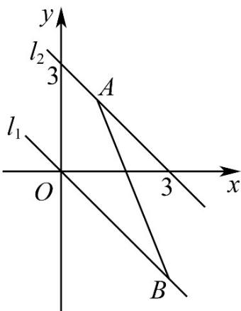

## 题型03 交点问题

【典例1】直线 $x + y + b = 0$ 与线段 $AB$ 没有公共点，其中 $A(1,2)$ ， $B(3,-3)$ ，则实数 $b$ 的取值范围是\_\_\_\_。
【答案】 $(-∞,-3)∪(0,+∞)$

【分析】数形结合即可求得 $b$ 的取值范围·

【详解】由题可知，当直线 y = -x - b 经过点 $A(1,2)$ 时 b = -3 ，

当直线 $y = -x - b$ 经过点 $B(3, - 3)$ 时 $b = 0$

当直线 $x + y + b = 0$ 与线段 AB 没有公共点，

则 b < -3 或 b > 0.

故答案为： $(-∞,-3)∪(0,+∞)$ .

## 方法技巧

直接联立两直线方程，解方程即可。

![[高中/课堂同步/题库/人教A版高中数学同步讲义(2026)/03_选择性必修第一册/第二章 直线和圆的方程/讲义/专题2_3_直线的交点坐标与距离公式_高效培优讲义_/题型03_交点问题_sec_13/questions/Q00063474.md]]
![[高中/课堂同步/题库/人教A版高中数学同步讲义(2026)/03_选择性必修第一册/第二章 直线和圆的方程/讲义/专题2_3_直线的交点坐标与距离公式_高效培优讲义_/题型03_交点问题_sec_13/questions/Q00063475.md]]
![[高中/课堂同步/题库/人教A版高中数学同步讲义(2026)/03_选择性必修第一册/第二章 直线和圆的方程/讲义/专题2_3_直线的交点坐标与距离公式_高效培优讲义_/题型03_交点问题_sec_13/questions/Q00063476.md]]
