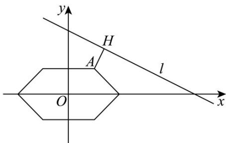

> [!faq]- 《专题2_3_直线的交点坐标与距离公式_高效培优讲义_》官方解析
>
> > [!success]- **【答案】** A
>
> > [!note]- **【分析】**
> > 由题意可知 $P$ 的轨迹关于 $x$ 轴对称，也关于 $y$ 轴对称，进而先研究其在 $x = 0, y = 0$ 时的函数解析式，
> >
> > 并画出其图象，结合对称性可将图象补充完整，数形结合求解即可·
>
> > [!note]- **【解析】**
> > 由题意可知，P 的轨迹关于 x 轴对称，也关于 y 轴对称。
> >
> > 当 $x = 0, y = 0$ 时， $\left\| PF_1 \right\| + \left\| PF_2 \right\| = |x + 1| + |x - 1| + 2|y| = x + 1 + |x - 1| + 2y = 4$
> >
> > 即 $y=\begin{cases}1,0\leq x\leq1,\\2-x,1<x\leq2.\end{cases}$
> >
> > 画出此函数的图象，并结合对称性可得点 $P$ 的轨迹是如图所示的六边形.
> >
> > 由图可知， $|PQ|$ 的最小值为图中点 $A(1,1)$ 到直线 $l$ 的距离 $\left|AH\right| = \frac{\left|1 + 2 - 5\right|}{\sqrt{5}} = \frac{2\sqrt{5}}{5}$
> >
> > 故选：A
> >
> > 
