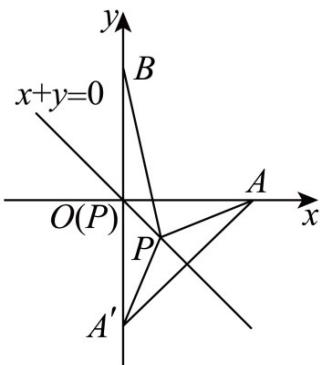

> [!faq]- 《专题2_3_直线的交点坐标与距离公式_高效培优讲义_》官方解析
>
> > [!success]- **【答案】** 4
>
> > [!note]- **【分析】**
> > 根据所求式子，转化为动点到两个定点的距离和，利用数形结合，结合对称性，即可求最小值·
>
> > [!note]- **【解析】**
> > $\sqrt{(x - 2)^2 + y^2} +\sqrt{x^2 + (y - 2)^2} = \sqrt{(x - 2)^2 + (y - 0)^2} +\sqrt{(x - 0)^2 + (y - 2)^2}$
> >
> > 表示直线 $x + y = 0$ 上的点到定点 $A(2,0)$ 和 $B(0,2)$ 的距离和，如图，
> >
> > 
> >
> > 点 $A(2,0)$ 关于 $y = -x$ 的对称点为 $A'(0, - 2)$ ， $\left|PA\right| + \left|PB\right| = \left|PA'\right| + \left|PB\right|$ $\left|A'B\right| = 4$
> >
> > 当点 $A', P, B$ 三点重合时， $\left|PA\right| + \left|PB\right|$ 最小，最小值为 4.
> >
> > 故答案为：4
