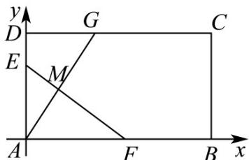

<!-- question-source:start -->
【变式1】如图所示，在平面直角坐标中，已知矩形ABCD的长为 $2$ ，宽为 $1$ ，边 $AB$ 、 $AD$ 分别在 $x$ 轴、 $y$ 轴

的正半轴上，点A与坐标原点重合，将矩形折叠，使点A落在线段 $DC$ 上，若折痕所在直线的斜率为 $k$ ，则

折痕所在的直线方程为\_\_\_\_。

<!-- question-source:end -->

![[高中/课堂同步/题库/人教A版高中数学同步讲义(2026)/03_选择性必修第一册/第二章 直线和圆的方程/讲义/专题2_3_直线的交点坐标与距离公式_高效培优讲义_/题型_04_对称问题_sec_14/questions/answers/Q00063477A1.md]]
