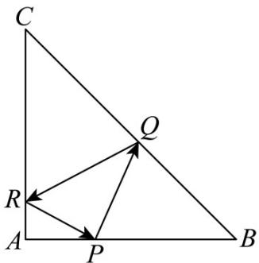

<!-- question-source:start -->
【变式3】在等腰直角VABC中，AB = AC = 6，点P是边AB上异于端点的一点，光线从点P出发经BC、CA
边反射后又回到点 $P$ ，若光线QR经过VABC的重心，则 $^{\triangle}PQB$ 的面积等于（）

A. $\frac{16}{3}$ B. 4 C. 5 D. $\frac{15}{4}$
<!-- question-source:end -->

![[高中/课堂同步/题库/人教A版高中数学同步讲义(2026)/03_选择性必修第一册/第二章 直线和圆的方程/讲义/专题2_3_直线的交点坐标与距离公式_高效培优讲义_/题型_04_对称问题_sec_14/questions/answers/Q00063479A1.md]]
