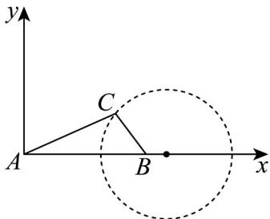

> [!faq]- 《专题2_4_圆的方程_高效培优讲义_》官方解析
>
> > [!success]- **【答案】** $\left(0,\frac{4}{3}\right]$
>
> > [!note]- **【分析】**
> > 以A为坐标原点AB所在直线为 $x$ 轴建立平面直角坐标系，设出点 $C$ 坐标，根据 $AC = 2BC$ 列等式，
> >
> > 即可得到 C 的轨迹·再求点 C 到 AB 的距离范围即可得到三角形 ABC 的面积的取值范围·
>
> > [!note]- **【解析】**
> > 以 $^{A}$ 为坐标原点AB所在直线为x轴建立平面直角坐标系，设 $C(x,y)$ ， $A(0,0),B(2,0)$
> >
> > 
> >
> > 因为 $AC = 2BC$ ，所以 $\sqrt{x^2 + y^2} = 2\sqrt{(x - 2)^2 + y^2}$ ，化简得 $\left(x - \frac{8}{3}\right)^2 +y^2 = \frac{16}{9}$
> >
> > 则点 C 的轨迹为以 $\left(\frac{8}{3},0\right)$ 为圆心，半径为 $\frac{4}{3}$ 的圆（除去两点 $\left(\frac{4}{3},0\right),\left(4,0\right)$
> >
> > 则点 C 到直线 AB 的最大距离即为半径 $\frac{4}{3}$ ，此时三角形 ABC 的面积 $S = \frac{1}{2} AB \times \frac{4}{3} = \frac{4}{3}$ .
> >
> > 又点 $C$ 到直线 $AB$ 的距离可趋近于0，所以三角形 $ABC$ 的面积的取值范围为 $\left(0, \frac{4}{3}\right]$ .
> >
> > 故答案为： $\left(0, \frac{4}{3}\right]$
