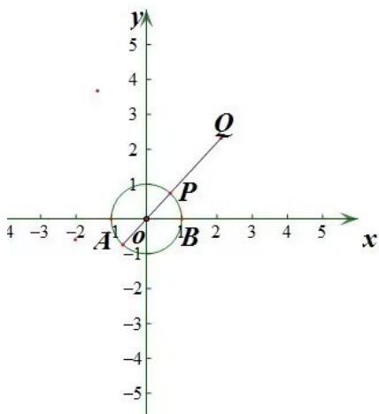

> [!faq]- 《专题2_4_圆的方程_高效培优讲义_》官方解析
>
> > [!success]- **【答案】** A
>
> > [!note]- **【分析】**
> > 通过直线方程求出两条直线所过的定点，再根据两直线垂直的条件判断两直线垂直，进而确定点 $P$ 的轨迹，最后结合点 $Q$ 的位置求出 $|PQ|$ 的最小值·
>
> > [!note]- **【解析】**
> > $l_{1}$ 可变形为 $\lambda (x + 1) + 2y = 0$ ，由 $\left\{ \begin{array}{ll} x + 1 = 0 & x = -1 \\ 2y = 0 & \text{可得} \end{array} \right.$ 可得 $\left\{ \begin{array}{ll} x = -1 \\ y = 0 \end{array} \right.$ ，则 $l_{1}$ 恒过定点 $A(-1,0)$ ，
> > 同理可得 $l_{2}$ 恒过定点 $B(1,0)$ ，且有 $\lambda \cdot 2 + 2 \cdot (-\lambda) = 0$ ，则 $l_{1} \perp l_{2}$ ，
> > 此时 $P$ 的轨迹是以 $AB$ 为直径的圆： $x^{2} + y^{2} = 1(y \neq 0)$ 。
> > 因 $|OQ| = 3$ ，由图知，当点 $P$ 在线段 $OQ$ 上时， $|PQ|$ 的值最小，其最小值为 $3 - 1 = 2$ 。
> >
> > 
> >
> > 故选 **A**.
