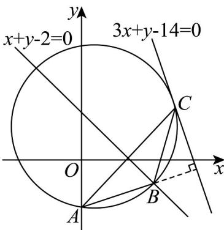

> [!faq]- 《专题2_4_圆的方程_高效培优讲义_》官方解析
>
> > [!success]- **【答案】** (1) $B(3,-1)$ ， $C(4,2)$ (2) $\left(x - \frac{1}{2}\right)^2 +\left(y - \frac{3}{2}\right)^2 = \frac{25}{2}$
>
> > [!note]- **【分析】**
> > （1）由 $AB$ 边上高线所在的方程及 $A(0, -2)$ 求得直线 $AB$ 方程，结合 $AC$ 边上中线所在直线方程即可
> >
> > 求得 B 的坐标；设 $C(m,-3m+14)$ ，则点 A, C 中点为 $\left(\frac{m}{2},\frac{-3m+12}{2}\right)$ ，代入 AC 中线方程即可求解；
> >
> > (2) 分别求得边 $AB, BC$ 的垂直平分线方程，求得外接圆圆心坐标，再根据两点之间距离公式求得半径即可
> >
> > 求解.
>
> > [!note]- **【解析】**
> > （1）因为 AB 边上的高所在直线的方程为 $3x + y - 14 = 0$ ，
> >
> > 所以 $k_{AB}=\frac{1}{3}$ ，则直线 AB 的方程为 $y+2=\frac{1}{3}x$ ，即 $y=\frac{1}{3}x-2$ ，
> >
> > 由 $\left\{\begin{aligned}y&=\frac{1}{3}x-2\\ x+y&=0\end{aligned}\right.$ 得， $\left\{\begin{aligned}x&=3\\ y&=-1\end{aligned}\right.$ ，所以 $B(3,-1)$ ，
> >
> > 设 $C(m, -3m + 14)$ ，则点 $A, C$ 中点为 $\left(\frac{m}{2}, \frac{-3m + 12}{2}\right)$
> >
> > 所以 $\frac{m}{2} +\frac{-3m + 12}{2} -2 = 0$ ，解得 $m = 4$ ，即 $C(4,2)$
> >
> > (2) 因为 $A(0,-2)$ ， $B(3,-1)$
> >
> > 所以 AB 的中点坐标为 $\left(\frac{3}{2}, -\frac{3}{2}\right)$ ， $k_{AB} = \frac{1}{3}$
> >
> > 所以线段 AB 的垂直平分线方程为 $y + \frac{3}{2} = -3\left(x - \frac{3}{2}\right)$ ，即 $y = -3x + 3$ ，
> >
> > 同理可得线段 BC 的垂直平分线方程为 $y = -\frac{1}{3}x + \frac{5}{3}$ ，
> >
> > <!-- source-part:2 pages:51-51 -->
> >
> > 由 $\left\{\begin{aligned}y&=-3x+3\\ y&=-\frac{1}{3}x+\frac{5}{3}\end{aligned}\right.$ 得， $\left\{\begin{aligned}x&=\frac{1}{2}\\ y&=\frac{3}{2}\end{aligned}\right.$ ，所以的外接圆圆心为 $\left(\frac{1}{2},\frac{3}{2}\right)$ ，
> > 所以VABC的外接圆半径为 $\sqrt{\left(\frac{1}{2}-0\right)^{2}+\left(\frac{3}{2}+2\right)^{2}}=\frac{5\sqrt{2}}{2}$ 所以VABC的外接圆方程为 $\left(x-\frac{1}{2}\right)^{2}+\left(y-\frac{3}{2}\right)^{2}=\frac{25}{2}$
> >
> > 
