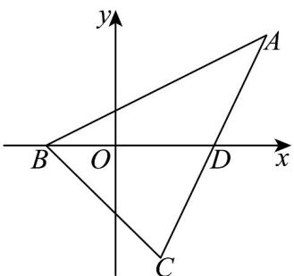
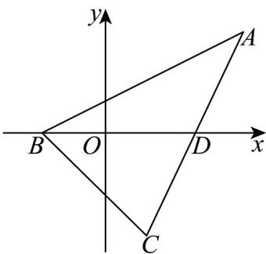

## 知识点 04 用待定系数法求圆的方程的步骤

求圆的方程常用“待定系数法”. 用“待定系数法”求圆的方程的大致步骤是：

(1) 根据题意，选择标准方程或一般方程．(2) 根据已知条件，建立关于 $a$ 、 $b$ 、 $r$ 或 $D$ 、 $E$ 、 $F$ 的方程组．

（3）解方程组，求出 $a$ 、 $b$ 、 $r$ 或 $D$ 、 $E$ 、 $F$ 的值，并把它们代入所设的方程中去，就得到所求圆的方程.

【即学即练】

1. 过三个点 $O(0,0)$ ， $A(6,8)$ ， $B(8,-6)$ 的圆的方程为 \_\_\_\_。

【答案】 $(x - 7)^2 +(y - 1)^2 = 50$

【分析】利用待定系数法，建立方程组，解之即可求解·

【详解】设圆的一般方程为 $x^{2} + y^{2} + Dx + Ey + F = 0(D^{2} + E^{2} - 4F > 0)$

则 $\left\{ \begin{array}{l} F = 0 \\ 36 + 64 + 6E + 8E + F = 0 \\ 64 + 36 + 8E - 6E + F = 0 \end{array} \right.$ ，解得 $\left\{ \begin{array}{l} F = 0 \\ D = -14 \\ E = -2 \end{array} \right.$

所以圆的方程为 $x^{2} + y^{2} - 14x - 2y = 0$ .

故答案为： $(x - 7)^{2} + (y - 1)^{2} = 50$

2．已知点 $A(-2,1)$ , $B(-1,0)$ , $C(2,3)$ ， $M(a,2)$ 四点共圆，则 a= \_\_\_\_.

【答案】 $\pm \sqrt{5}$

【分析】设过 A, B, C 的圆的一般方程，再列方程组，求得其一般方程，再将点 M 坐标代入即可.

【详解】设过 A, B, C 的圆的方程为 $x^{2} + y^{2} + Dx + Ey + F = 0$ 且 $D^{2} + E^{2} - 4F > 0$ ,

则 $\left\{ \begin{array}{l} 4 + 1 - 2D + E + F = 0 \\ 1 - D + F = 0 \\ 4 + 9 + 2D + 3E + F = 0 \end{array} \right.$ ，解得 $\left\{ \begin{array}{l} D = 0 \\ E = -4 \\ F = -1 \end{array} \right.$

所以过 $A, B, C$ 的圆的方程为 $x^{2} + y^{2} - 4y - 1 = 0$

又因为点 $M$ 在此圆上，所以 $a^2 + 4 - 8 - 1 = 0$ ，解得 $a^2 = 5$ ，所以 $a = \pm \sqrt{5}$

故答案为： $\pm \sqrt{5}$

知识点 05 轨迹方程

求符合某种条件的动点的轨迹方程，实质上就是利用题设中的几何条件，通过“坐标法”将其转化为关于变量

$x, y$ 之间的方程.

1. 当动点满足的几何条件易于“坐标化”时，常采用直接法；当动点满足的条件符合某一基本曲线的定义（如

圆）时，常采用定义法；当动点随着另一个在已知曲线上的动点运动时，可采用代入法（或称相关点法）.

2. 求轨迹方程时，一要区分“轨迹”与“轨迹方程”；二要注意检验，去掉不合题设条件的点或线等。

3. 求轨迹方程的步骤：（1）建立适当的直角坐标系，用 $(x, y)$ 表示轨迹（曲线）上任一点 $M$ 的坐标；

(2) 列出关于 $x, y$ 的方程；(3) 把方程化为最简形式；(4) 除去方程中的瑕点（即不符合题意的点）；

(5) 作答.

【即学即练】

1. 如图，在等腰 $\mathrm{V}ABC$ 中，已知 $|AB| = |AC|$ ， $B(-1,0)$ ， $AC$ 边的中点为 $D(2,0)$ ，则点 $C$ 的轨迹所包围的图

形的面积等于\_\_\_\_。

【答案】 $4\pi$

【分析】利用解析几何思想直接求出点A的轨迹方程，再用相关点法求出点C的轨迹方程，从而可以判断轨

迹是圆，再用圆的面积公式即可求解·

【详解】

因为 $\left|AB\right|=2\left|AD\right|$ ，所以点 A 的轨迹是阿波罗尼斯圆，

设点 $A(x,y)$ ，代入两点间距离公式可得： $\sqrt{(x + 1)^2 + y^2} = 2\sqrt{(x - 2)^2 + y^2}$

整理方程得： $(x - 3)^{2} + y^{2} = 4(y\neq 0)$

又设动点 $C(x,y)$ ，由 AC 边的中点为 $D(2,0)$ ，可知点 $A(4-x,-y)$ ，代入以上方程，

可得点 C 的轨迹方程为 $(4 - x - 3)^{2} + (-y)^{2} = 4(y \neq 0)$ ,

即 $(x - 1)^2 + y^2 = 4(y \neq 0)$ ，故所求的面积为 $4\pi$ 。

故答案为： $4\pi \cdot$

2. 已知VABC的三个顶点分别是 $A(4,0), B(0,2), C(3,1)$ .

(1)求VABC的外接圆G（G为圆心）的标准方程：

(2)若点 $P$ 的坐标是 $(6,0)$ ，点 $Q$ 是圆 $G$ 上的一个动点，点 $M$ 满足 $\frac{PM}{3} = \frac{1}{3} \frac{PQ}{Q}$ ，求点 $M$ 的轨迹方程，并说明轨

迹的形状·

【答案】(1) $x^{2}+(y+3)^{2}=25$

(2) $(x - 4)^{2} + (y + 1)^{2} = \frac{25}{9}$ ，轨迹是以 $(4, - 1)$ 为圆心，半径为 $\frac{5}{3}$ 的圆

【分析】（1）利用待定系数法求解圆的方程即可·

(2) 根据题干设 M 的坐标是 $(x, y)$ ，点 Q 的坐标是 $(x_{0}, y_{0})$ ，再由 $\frac{1}{3}PM = \frac{1}{3}PQ$

列出方程代入 $x^{2}+(y+3)^{2}=25$ 即可求得轨迹方程.

【详解】（1）设圆 G 的方程为 $x^{2} + y^{2} + Dx + Ey + F = 0$ （其中 $D^{2} + E^{2} - 4F > 0$ ）

因为 $A,B,C$ 三点都在圆上，可得 $\left\{ \begin{array}{l}4D + F + 16 = 0\\ 2E + F + 4 = 0\\ 3D + E + F + 10 = 0 \end{array} \right.$

解得 $D = 0, E = 6, F = -16$ ，满足 $D^2 + E^2 - 4F > 0$

所以所求圆 G 的方程为 $x^{2} + y^{2} + 6y - 16 = 0$ ，即 $x^{2} + (y + 3)^{2} = 25$

(2) 设 M 的坐标是 $(x, y)$ ，点 Q 的坐标是 $(x_{0}, y_{0})$

因为 $P$ 的坐标是 $(6,0)$ ，且 $\boxed{PM} = \frac{1}{3} \boxed{PQ}$

所以 $(x - 6, y) = \frac{1}{3} (x_0 - 6, y_0)$ ，解得 $x_0 = 3x - 12, y_0 = 3y$ ，

又因为点 $Q$ 在圆 $G$ 上运动，所以点 $Q$ 的坐标满足圆 $G$ 的方程，即 $x_0^2 + (y_0 + 3)^2 = 25$

代入得 $(3x-12)^{2}+(3y+3)^{2}=25$ ，整理得 $(x-4)^{2}+(y+1)^{2}=\frac{25}{9}$

点 $M$ 的轨迹方程是 $(x - 4)^2 +(y + 1)^2 = \frac{25}{9}$ ，轨迹是以 $(4, - 1)$ 为圆心，半径为 $\frac{5}{3}$ 的圆
