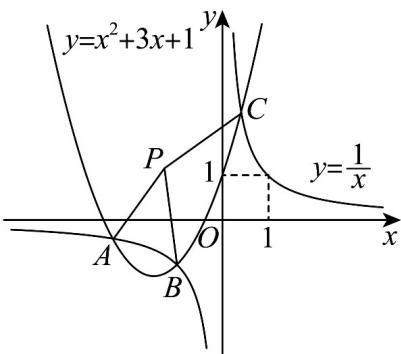

> [!faq]- 《专题2_4_圆的方程_高效培优讲义_》官方解析
>
> > [!success]- **【答案】** $(-1,1)$
>
> > [!note]- **【分析】**
> > 利用方程组思想，结合三次方程求根，然后得到三点坐标，利用三点确定一个圆，通过圆心来确定
> >
> > 点 $P$ 即可·
>
> > [!note]- **【解析】**
> > 
> >
> > 由已知两函数解析式联立方程组，消元得： $x^{2} + 3x + 1 = \frac{1}{x}\Rightarrow x^{3} + 3x^{2} + x - 1 = 0$
> >
> > 发现 $x = -1$ 是方程的根，则可因式分解为 $x^{3} + x^{2} + 2x^{2} + 2x - x - 1 = 0 \Rightarrow (x + 1)(x^{2} + 2x - 1) = 0$
> >
> > 所以可以解得： $x_{1} = -1, x_{2} = -1 - \sqrt{2}, x_{3} = -1 + \sqrt{2}$
> >
> > 分别代入到 $y=\frac{1}{x}$ 可得： $y_{1}=-1, y_{2}=1-\sqrt{2}, y_{3}=1+\sqrt{2}$
> >
> > 由 $\left|\overline{PA}\right|=\left|\overline{PB}\right|=\left|\overline{PC}\right|$ ，可知点P为三角形ABC的圆心，
> >
> > 所以由 $A\left(-1-\sqrt{2},1-\sqrt{2}\right),B\left(-1,-1\right),C\left(\sqrt{2}-1,\sqrt{2}+1\right)$ 确定一个圆，
> >
> > 设圆的方程为 $x^{2} + y^{2} + Dx + Ey + F = 0$ ，则可得：
> >
> > $$
> > \left[ (- 1 - \sqrt {2}) ^ {2} + (1 - \sqrt {2}) ^ {2} + D (- 1 - \sqrt {2}) + E (1 - \sqrt {2}) + F = 0 \right.
> > $$
> >
> > $$
> > \left\{1 + 1 - D - E + F = 0 \right.
> > $$
> >
> > $$
> > \left[ \left(\sqrt {2} - 1\right) ^ {2} + \left(\sqrt {2} + 1\right) ^ {2} + D (\sqrt {2} - 1) + E (\sqrt {2} + 1) + F = 0 \right.
> > $$
> >
> > 解得： $\left\{\begin{aligned}D&=2\\ E&=-2\\ F&=-2\end{aligned}\right.$
> >
> > 所以圆的方程为 $x^{2} + y^{2} + 2x - 2y - 2 = 0$
> >
> > 化为圆的标准方程得： $\left(x + 1\right)^2 +\left(y - 1\right)^2 = 4$
> >
> > 所以可得圆心坐标为 $P(-1,1)$
> >
> > 故答案为： $(-1,1)$ .
