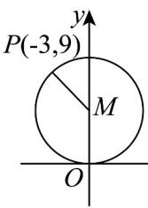
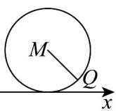

## 题型03 点与圆的位置关系

【典例1】已知如图点 $P(-3,9)$ 在圆 $M$ 上，圆 $M$ 沿着 $x$ 轴顺时针滚动 $\pi$ 弧度，点 $P$ 到了点 $Q$ 的位置，则点 $Q$

的坐标为（ ）

A (3,1) B (5π+3,1) C (5π,1) D (5π-3,1)

【答案】B

【分析】求出圆的半径，再求出相关长度即可·

【详解】设原来圆的方程为 $x^{2}+(y-r)^{2}=r^{2}$ ，代入点 $P(-3,9)$ 得

$3^{2} + (9 - r)^{2} = r^{2}$ ，解得 $r = 5$ ，则圆的方程为 $x^{2} + (y - 5)^{2} = 25$

则 $x_{Q} = \pi r + 3 = 5\pi +3$ ， $y_{Q} = r - \sqrt{r^{2} - \left|x_{p}\right|} = 5 - 4 = 1$

则点 $Q$ 的坐标为 $(5\pi + 3, 1)$ .

故选：B.

## 方法技巧

如果圆的标准方程为 $(x-a)^{2}+(y-b)^{2}=r^{2}$ ，圆心为 $C(a,b)$ ，半径为 r，则有（1）若点 $M(x_{0},y_{0})$ 在圆上 $\Leftrightarrow|CM|=r\Leftrightarrow(x_{0}-a)^{2}+(y_{0}-b)^{2}=r^{2}$ （2）若点 $M(x_{0},y_{0})$ 在圆外 $\Leftrightarrow|CM|>r\Leftrightarrow(x_{0}-a)^{2}+(y_{0}-b)^{2}>r^{2}$ （3）

若点 $M(x_{0},y_{0})$ 在圆内 $\Leftrightarrow|CM|<r\Leftrightarrow(x_{0}-a)^{2}+(y_{0}-b)^{2}<r^{2}$

![[高中/课堂同步/题库/人教A版高中数学同步讲义(2026)/03_选择性必修第一册/第二章 直线和圆的方程/讲义/专题2_4_圆的方程_高效培优讲义_/题型03_点与圆的位置关系_sec_12/questions/Q00063514.md]]
![[高中/课堂同步/题库/人教A版高中数学同步讲义(2026)/03_选择性必修第一册/第二章 直线和圆的方程/讲义/专题2_4_圆的方程_高效培优讲义_/题型03_点与圆的位置关系_sec_12/questions/Q00063515.md]]
