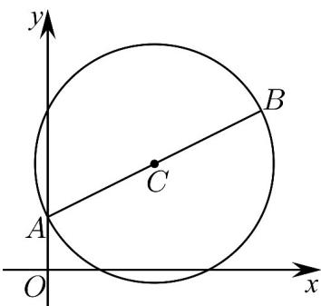

> [!faq]- 《专题2_4_圆的方程_高效培优讲义_》官方解析
>
> > [!success]- **【答案】** (1) $(x-2)^{2}+(y-2)^{2}=5$ ； (2)定点坐标为 $(4,1)$ ，证明见解析.
>
> > [!note]- **【分析】**
> > （1）求出 $C$ 的坐标，根据两点间的距离公式求出 $\left|CA\right|$ ，从而可求解；
> >
> > (2) 设点 $P(x,y)$ 是圆 C 上任意一点，由 AB 是圆 C 的直径，得 $AP \cdot BP = 0$ ，从而可求出圆 C 的方程，即可得
> >
> > 出结论
>
> > [!note]- **【解析】**
> > （1）当 $a = 3$ ， $B(4,3)$ ，故 $C(2,2)$ ， $\left|CA\right| = \sqrt{(2 - 0)^2 + (2 - 1)^2} = \sqrt{5}$
> >
> > 所以此时圆 C 的标准方程为 $(x-2)^{2}+(y-2)^{2}=5$ .
> >
> > 
> >
> > (2) 设点 $P(x,y)$ 是圆 C 上任意一点，
> >
> > 因为 $AB$ 是圆 $C$ 的直径，所以 $\overline{AP} \cdot \overline{BP} = 0$
> >
> > 即 $(x,y - 1)\cdot (x - 4,y - a) = x(x - 4) + (y - 1)(y - a) = 0$
> >
> > 所以圆 $C$ 的方程为： $x(x - 4) + (y - 1)(y - a) = 0$
> >
> > 则 x=4 ，y=1 ，等式恒成立，定点为 $(4,1)$ ，
> >
> > 所以无论 $a$ 取何正实数，圆 $C$ 恒经过除A外的另一个定点，定点坐标为 $(4,1)$
