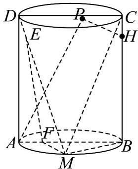

<!-- question-source:start -->
【变式3】如图，已知圆柱的轴截面是矩形 $ABCD, AB = 2, BC = 4$ ，点 $M$ 为 $\boxed{AB}$ 上不同于 $A, B$ 的一点，点 $H$

在 $BC$ 上，且 $BH = \frac{61}{16}$ ，动点 $E, F$ 满足 $DE = \lambda DM, AF = \lambda AB (0 < \lambda < 1)$ ，动点 $P$ 在上底面上，满足 $AP \perp PH$ 。

(1)证明： $EF \parallel$ 平面 BCM；

(2)① 求动点 $P$ 的轨迹长度；

②当点 $M$ 为 $\overline{AB}$ 的中点时，若平面 $MEF$ 与平面 $MBC$ 的夹角的余弦值为 $\overline{17}$ ，求 $\lambda$ 的值。

$$
\frac {2 \sqrt {3 4}}{1 7}
$$
<!-- question-source:end -->

![[高中/课堂同步/题库/人教A版高中数学同步讲义(2026)/03_选择性必修第一册/第二章 直线和圆的方程/讲义/专题2_4_圆的方程_高效培优讲义_/题型06_轨迹问题_sec_15/questions/answers/Q00063524A1.md]]
