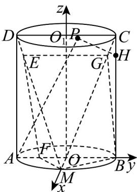

> [!faq]- 《专题2_4_圆的方程_高效培优讲义_》官方解析
>
> > [!success]- **【答案】** $^{(1)}$ 证明见解析 (2)① $\pi$ ; ② $\frac{1}{2}$
>
> > [!note]- **【分析】**
> > （1）在 $CM$ 上取点 $G$ ，使得 $CG = \lambda CM$ ，连接 $EG, BG$ ，通过四边形 $EGBF$ 为平行四边形，得到
> >
> > $BG // EF$ ，即可求证；
> >
> > (2) 建系，①由 $AP \cdot HP = 0$ ，确定动点 P 的轨迹是半径为 $\frac{1}{2}$ 的圆，即可求解；②求得平面法向量，代入夹角
> >
> > 公式即可求解·
>
> > [!note]- **【解析】**
> > （1）在CM上取点G，使得 $CG=\lambda CM$ ，连接EG,BG
> >
> > 因为 $\overline{DE} = \lambda \overline{DM}$ ，所以 $\frac{ME}{MD} = \frac{MG}{MC} = 1 - \lambda$ ，
> >
> > 所以 $EG / / CD$ ，且 $EG = (1 - \lambda)CD$
> >
> > 又 $AF = \lambda AB$ ，所以 $BF = (1 - \lambda)AB$ ，又 $AB // CD$ ，
> >
> > 所以 $BF // EG$ ，且 $BF = EG$ ，则四边形 $EGBF$ 为平行四边形，所以 $BG // EF$
> >
> > 因为 $BG \subset$ 平面 BCM, $EF \not\subset$ 平面 BCM ，故 $EF \parallel$ 平面 BCM ；
> >
> > (2) 分别取 $AB, CD$ 的中点 $O, O_1$ ，连接 $OO_1$ ，则 $OO_1 \perp$ 底面圆 $O$ ，连接 $OM$
> >
> > 因为点 $M$ 为 $\square AB$ 的中点，所以 $OM \perp AB$ ，易得 $OO_{1} \perp OM, OO_{1} \perp AB$
> >
> > 以 $O$ 为原点，以 $OM, OB$ ， $OO_{1}$ 所在直线分别为 $x, y, z$ 轴建立如图所示空间直角坐标系 $O - xyz$
> >
> > $$
> > A (0, - 1, 0), D (0, - 1, 4), M (1, 0, 0), F (0, 2 \lambda - 1, 0), P (x, y, 4), H \left(0, 1, \frac {6 1}{1 6}\right), \text {则} \quad M A = (- 1, - 1, 0)
> > $$
> >
> > $$
> > \stackrel {\square \square \square} {M F} = (- 1, 2 \lambda - 1, 0), \stackrel {\square \square \square \square} {M D} = (- 1, - 1, 4), \stackrel {\square \square \square} {A P} = (x, y + 1, 4), \stackrel {\square \square \square} {H P} = (x, y - 1, \frac {3}{1 6})
> > $$
> >
> > 
> > - **①**：因为 $AP \perp PH$ ，所以 $AP \cdot HP = 0$ ，所以 $x^2 + y^2 - 1 + \frac{3}{4} = 0, x^2 + y^2 = \frac{1}{4}$
> >
> > 则动点 $P$ 的轨迹是半径为 $\frac{1}{2}$ 的圆，其轨迹长度为 $\pi$ ；
> > - **②**：设平面 $MEF$ 的法向量为 $m = (x, y, z)$
> >
> > 由 $\left\{\begin{aligned}&\stackrel{\square\square\square}{ME}\cdot m=0\\&\stackrel{\square\square\square\square}{MD}\cdot m=0\end{aligned}\right.$ 得 $\left\{\begin{aligned}-x+(2\lambda-1)y=0,\\-x-y+4z=0,\end{aligned}\right.$ 取 $y=1$ ，则 $m=\left(2\lambda-1,1,\frac{\lambda}{2}\right)$ ，
> >
> > 因为 $AM \perp MB, BC \perp AM, BM \cap BC = B$ ，都在平面 $MBC$ 内，所以 $AM \perp$ 平面 $MBC$
> >
> > 所以 $\stackrel{\cup\cup}{MA}$ 是平面 MBC 的一个法向量，记为 $n = \stackrel{\cup\cup}{MA} = (-1, -1, 0)$
> >
> > 所以 $\cos\left\langle\vec{m},n\right\rangle=\frac{\vec{m}\cdot n}{|m||n|}=\frac{-2\lambda}{\sqrt{2}\times\sqrt{\frac{17\lambda^{2}}{4}-4\lambda+2}}=\frac{-\sqrt{2}\lambda}{\sqrt{\frac{17\lambda^{2}}{4}-4\lambda+2}}$
> >
> > 由题意可知， $\frac{\sqrt{2}\lambda}{\sqrt{\frac{17\lambda^2}{4} - 4\lambda + 2}} = \frac{2\sqrt{34}}{17}$ 整理得 $2\lambda - 1 = 0$ ，解得 $\lambda = \frac{1}{2}$
> >
> > 故 $\lambda$ 的值为 $\frac{1}{2}$
