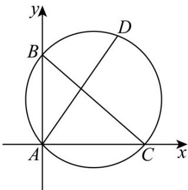

> [!faq]- 《专题2_5_直线与圆_圆与圆的位置关系_高效培优讲义_》官方解析
>
> > [!success]- **【答案】** A
>
> > [!note]- **【解析】**
> > 
> >
> > 以 A 为坐标原点，AC 为 x 轴，AB 为 y 轴建系，
> >
> > 设 $C(c,0),B(0,b)$ ，则 $b^{2} + c^{2} = 4$
> >
> > 则 $BC$ 中点坐标为 $\left(\frac{c}{2},\frac{b}{2}\right)$
> >
> > 因为 $\angle A = 90^{\circ}$ ， $|BC| = 2$
> >
> > 所以 VABC 的外接圆 O 即为以 BC 中点为圆心，半径为 $^{1}$ 的圆，
> >
> > 方程为： $\left(x - \frac{c}{2}\right)^2 +\left(y - \frac{b}{2}\right)^2 = 1$
> >
> > 由 $\angle A$ 的角平分线的平分线方程为：y = x
> >
> > 两方程联立可得： $2x^{2} - (b + c)x = 0$
> >
> > 解得 $x = 0$ 或 $x = \frac{b + c}{2}$
> >
> > 所以 $D$ 的坐标为 $\left(\frac{b + c}{2},\frac{b + c}{2}\right)$
> >
> > 又 $\left|AD\right|=\sqrt{3}$
> >
> > 所以 $\left(\frac{b + c}{2}\right)^2 +\left(\frac{b + c}{2}\right)^2 = 3$
> >
> > 即 $(b+c)^{2}=6$ ，结合 $b^{2}+c^{2}=4$ ，
> >
> > 可得：bc=1，
> >
> > 即 $\left|AB\right|\cdot\left|AC\right|=1$
> >
> > 故选 **A**
