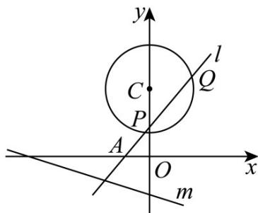

<!-- question-source:start -->
14. 已知过点 $A(-1,0)$ 的直线 $l$ 与圆 $C: x^2 + (y - 3)^2 = 4$ 相交于 $P$ 、 $Q$ 两点，直线 $m: x + 3y + 6 = 0$

(1) 当 $|PQ| = 2\sqrt{3}$ 时，求直线 $l$ 的方程；

(2)设 $T$ 为直线 $m$ 上的动点，过 $T$ 作圆 $C$ 的两条切线 $TG$ 、 $TH$ ，切点分别为 $G$ 、 $H$ ，求四边形 $TGCH$ 面积的

最小值；

(3)是否存在直线 $l$ ，使得向量 $\overline{OP} +\overline{OQ}$ 与 $AC$ 共线？如果存在，求出直线 $l$ 的方程；如果不存在，请说明理由.
<!-- question-source:end -->

![[高中/课堂同步/题库/人教A版高中数学同步讲义(2026)/03_选择性必修第一册/第二章 直线和圆的方程/讲义/专题2_5_直线与圆_圆与圆的位置关系_高效培优讲义_/强化训练_sec_18/questions/answers/Q00063585A1.md]]
