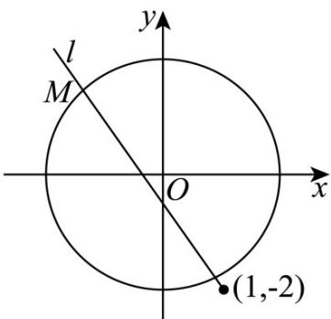

> [!faq]- 《专题2_5_直线与圆_圆与圆的位置关系_高效培优讲义_》官方解析
>
> > [!success]- **【答案】** $(-∞,0]∪[4/3,+∞)$
>
> > [!note]- **【解析】**
> > 由动点 $M(x,y)$ 到点 $A(-1,0),B(1,0)$ 距离的平方和为10，得 $(x + 1)^2 +y^2 +(x - 1)^2 +y^2 = 10$
> >
> > 则点 $M$ 的轨迹方程为 $x^{2} + y^{2} = 4$ ，点 $M(x,y)$ 的轨迹是以原点 $(0,0)$ 为圆心，半径 $r = 2$ 的圆，
> >
> > $\frac{y + 2}{x - 1}$ 可看作是点 $M(x,y)$ 与点 $(1, - 2)$ 连线的斜率 $k = \frac{y - (-2)}{x - 1}$
> >
> > 设直线 $l:y + 2 = k(x - 1)$ ，即 $kx - y - k - 2 = 0$ ，则圆心 $(0,0)$ 到直线 $l$ 的距离 $d = \frac{|-k - 2|}{\sqrt{k^2 + 1}}$
> >
> > 由直线 l 与圆有公共点，得圆心到直线 l 的距离 $d = \frac{|-k - 2|}{\sqrt{k^{2} + 1}} \leq 2$ ，整理得 $3k^{2} - 4k = 0$ ，解得 $k = \frac{4}{3}$ 或 $k \leq 0$
> >
> > 所以 $\frac{y + 2}{x - 1}$ 的取值范围为 $(- \infty, 0] \cup [\frac{4}{3}, +\infty)$
> >
> > 故答案为： $(-∞,0]∪[4/3,+∞)$
> >
> > 
