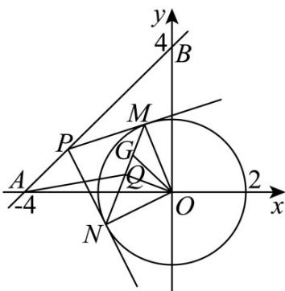

> [!faq]- 《专题2_5_直线与圆_圆与圆的位置关系_高效培优讲义_》官方解析
>
> > [!success]- **【答案】** D
>
> > [!note]- **【解析】**
> > 设点 $P(t, t + 4)$ ， $M(x_1, y_1)$ ， $N(x_2, y_2)$
> >
> > 因为 $PM, PN$ 是圆的切线，所以 $OM \perp PM, ON \perp PN$
> >
> > 
> >
> > 所以 M, N 在以 OP 为直径的圆上，
> >
> > 其圆的方程为 $\left(x-\frac{t}{2}\right)^{2}+\left(y-\frac{t+4}{2}\right)^{2}=\frac{t^{2}+\left(t+4\right)^{2}}{4}$
> >
> > 又 M, N 在圆 $x^{2} + y^{2} = 4$ 上，
> >
> > 则将两个圆的方程作差得直线 $MN$ 的方程： $tx + (t + 4)y - 4 = 0$
> >
> > 即 $t(x + y) + 4(y - 1) = 0$ ，所以直线MN恒过定点 $G(-11)$
> >
> > 又因为 $OQ \perp MN$ ，Q, G, M, N 四点共线，所以 $OQ \perp QG$ ，
> >
> > 即 $Q$ 在以 $OG$ 为直径的圆 $\left(x + \frac{1}{2}\right)^2 +\left(y - \frac{1}{2}\right)^2 = \frac{1}{2}$ 上，
> >
> > 其圆心为 $O'\left(-\frac{1}{2}, \frac{1}{2}\right)$ ，半径为 $r=\frac{\sqrt{2}}{2}$
> >
> > 所以 $\left|AQ\right|_{\max}=\left|AO'\right|+r=\sqrt{\left(-\frac{1}{2}+4\right)^{2}+\left(\frac{1}{2}\right)^{2}}+\frac{\sqrt{2}}{2}=3\sqrt{2}$
> >
> > 所以 $|AQ|$ 的最大值为 $3\sqrt{2}$
> >
> > 故选 **D**.
