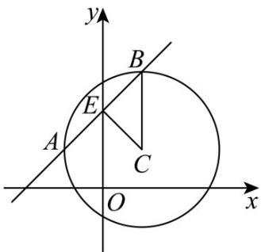

> [!faq]- 《专题2_5_直线与圆_圆与圆的位置关系_高效培优讲义_》官方解析
>
> > [!success]- **【答案】** (1)圆心 $(1,1)$ ，半径r=2 (2) $2\sqrt{2}$
>
> > [!note]- **【解析】**
> > （1）圆 $C: x^{2} + y^{2} - 2x - 2y - 2 = 0$ 的标准方程为： $(x - 1)^{2} + (y - 1)^{2} = 4$
> >
> > ∴圆 $C$ 的圆心为 $(1,1)$ ，半径为 r=2。
> >
> > (2) 由 (1) 可知：圆 C 的圆心为 $C(1,1)$ ，半径为 r=2。
> >
> > 弦 AB 中点 E ，连接 CE ， BC ，如图所示·
> >
> > 由圆的性质可知 $CE \perp AB$ ， $\left|BE\right| = \left|AE\right| = \frac{1}{2}\left|AB\right|$
> >
> > ∴圆心 $C(1,1)$ 到直线 l: x - y + 2 = 0 的距离 $d = |CE| = \frac{|1 - 1 + 2|}{\sqrt{1^{2} + 1^{2}}} = \sqrt{2}$ .
> >
> > 
> >
> > 在 Rt△ CEB 中， $\left|BE\right|=\sqrt{\left|BC\right|^{2}-\left|CE\right|^{2}}=\sqrt{2^{2}-\left(\sqrt{2}\right)^{2}}=\sqrt{2}$ ，∴ $\left|AB\right|=2\left|BE\right|=2\sqrt{2}$
> >
> > 即直线 l 被圆 C 截得的弦 AB 的长度为 $2\sqrt{2}$ .
