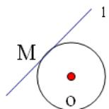

## 知识点 02 圆的切线方程的求法

1. 点 $M$ 在圆上，如图。

法一：利用切线的斜率 $k_{l}$ 与圆心和该点连线的斜率 $k_{OM}$ 的乘积等于-1，即 $k_{OM} \cdot k_l = -1$

法二：圆心 $O$ 到直线 $l$ 的距离等于半径 $r$ ：

2．点 $\left(x_{0},y_{0}\right)$ 在圆外，则设切线方程： $y-y_{0}=k(x-x_{0})$ ，变成一般式： $kx-y+y_{0}-kx_{0}=0$ ，因为与圆相切，

利用圆心到直线的距离等于半径，解出 $k$ ：

【即学即练】

1. 已知点 $M(1,2)$ 在圆 $C: x^2 + y^2 = r^2$ 上，则过点 $M$ 的圆 $C$ 的切线方程为 \_\_\_\_.

【答案】 $x + 2y - 5 = 0$

【详解】由于点 $M(1,2)$ 在圆 $C: x^{2} + y^{2} = r^{2}$ 上，

所以 $r^2 = 1^2 + 2^2 = 5$ ，所以圆 $C: x^2 + y^2 = 5$

所以圆心 $C(0,0)$ ， $k_{CM}=2$ ，

所以过点 $M$ 的圆 $C$ 的切线的斜率为 $-\frac{1}{2}$

所以过点 $M$ 的圆 $C$ 的切线方程为 $y - 2 = -\frac{1}{2} (x - 1)$

化简得 $x + 2y - 5 = 0$

故答案为： $x + 2y - 5 = 0$

2．已知 $M(x_{0},y_{0})$ 为圆 $O:x^{2}+y^{2}=4$ 上一点，过点M的圆O的切线l的方程为\_\_\_\_.

【答案】 $x_{0}x + y_{0}y - 4 = 0$

【详解】由圆 $O:x^{2} + y^{2} = 4$ ，可得圆心坐标为 $O(0,0)$ ，则 $k_{OM} = \frac{y_0}{x_0}$

则过点 $M$ 的圆 $O$ 的切线 $l$ 的斜率为 $k = -\frac{x_0}{y_0}$ ，且 $x_0^2 + y_0^2 = 4$

所以过点 M 的圆 O 的切线 l 的切线方程为 $y - y_{0} = -\frac{x_{0}}{y_{0}}(x - x_{0})$ ，

即 $x_0x + y_0y - (x_0^2 +y_0^2) = 0$ ，即 $x_0x + y_0y - 4 = 0$

故答案为： $x_0x + y_0y - 4 = 0$
