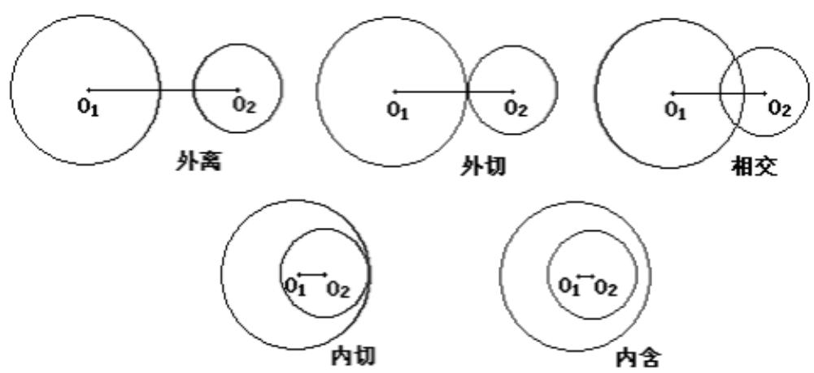

## 知识点 03 求直线被圆截得的弦长的方法

1. 应用圆中直角三角形：半径 $r$ ，圆心到直线的距离 $d$ ，弦长 $l$ 具有的关系 $r^2 = d^2 + \left(\frac{l}{2}\right)^2$ ，这也是求弦长最

常用的方法.

2. 利用交点坐标：若直线与圆的交点坐标易求出，求出交点坐标后，直接用两点间的距离公式计算弦长.
【即学即练】

1. 已知直线 $y = x + t$ 与圆 $x^{2} + y^{2} = 4$ 相交于 A, B 两点， $|AB| = 2\sqrt{2}$ ，则 $|t| =$ （）A.5 B.4 C.3 D.2

【答案】D

【详解】设圆心 $O(0,0)$ 到直线 $x - y + t = 0$ 的距离为 $d$

则由点到直线的距离公式可得 $d = \frac{|0 - 0 + t|}{\sqrt{1 + 1}} = \frac{|t|}{\sqrt{2}}$

因为 $\left|AB\right|=2\sqrt{2}$ ，圆的半径为 2，所以 $2\sqrt{2^{2}-\frac{t^{2}}{2}}=2\sqrt{2}$ ，解得 $\left|t\right|=2$ 。

故选：D.

2. 已知直线 $y = 2x$ 与圆 $(x - a)^2 + y^2 = 4$ 相交于 $A, B$ 两点，若 $|AB| = 2\sqrt{3}$ ，则 $|a| =$ （）

A. 1 B. $\frac{\sqrt{3}}{2}$ C. $\frac{\sqrt{5}}{2}$ D. $\frac{\sqrt{6}}{2}$

【答案】C

【详解】由题意有圆心 $(a,0)$ 到直线2x-y=0的距离为 $d=\frac{|2a|}{\sqrt{2^{2}+1}}=\frac{|2a|}{\sqrt{5}}$ ，
所以 $\left|AB\right|=2\sqrt{r^{2}-d^{2}}=2\sqrt{3}$ 又 $r^{2}=4$ 解得 $a^{2}=\frac{5}{4}\Rightarrow\left|a\right|=\frac{\sqrt{5}}{2}$

故选：C.
