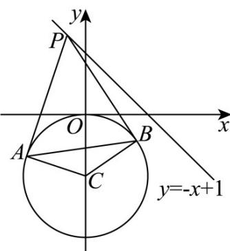

> [!faq]- 《专题2_5_直线与圆_圆与圆的位置关系_高效培优讲义_》官方解析
>
> > [!success]- **【答案】** $\sqrt{2}$
>
> > [!note]- **【解析】**
> > 设圆 $x^{2}+(y+1)^{2}=1$ 的圆心为 $C(0,-1)$ ，半径为 1，
> >
> > 由切线长定理可得 $\left|AP\right|=\left|BP\right|$
> >
> > 又因为 $\left|CA\right| = \left|CB\right|$ ， $\left|CP\right| = \left|CP\right|$ ，则 $\triangle CAP \cong \triangle CBP$ ，所以 $\angle APC = \angle BPC$
> >
> > 所以 $CP \perp AB$ ，则四边形 $ACBP$ 面积为 $\frac{1}{2} |AB| \cdot |PC| = |CA| \cdot |PA|$ ，
> >
> > 所以 $\left|AB\right|=\frac{2\left|CA\right|\cdot\left|PA\right|}{\left|PC\right|}=\frac{2\sqrt{\left|PC\right|^{2}-1}}{\left|PC\right|}=2\sqrt{1-\frac{1}{\left|PC\right|^{2}}}$
> >
> > 当 $|PC|$ 的长最小时，弦长 $|AB|$ 最小，
> >
> > 而 $\left|PC\right|$ 的最小值为圆心 $C(0,-1)$ 到直线 $y=-x+1$ 的距离，
> >
> > 所以 $\left|PC\right|_{\min}=\frac{\left|-2\right|}{\sqrt{2}}=\sqrt{2}$ ，所以 $\left|AB\right|_{\min}=2\sqrt{1-\frac{1}{2}}=\sqrt{2}$
> >
> > 故答案为： $\sqrt{2}$
> >
> > 
