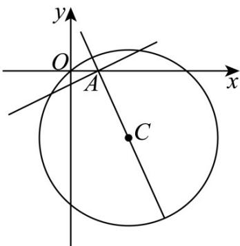

## 题型04 弦长问题

【典例1】已知直线 $l: x - my - 1 = 0$ ，圆 $C: x^2 + y^2 - 4x + 6y = 0$ ，若直线 $l$ 与圆 $C$ 交于 $M$ ， $N$ 两点，则 $\left|MN\right|$ 的取

值范围为\_\_\_\_。

【答案】 $\left[2\sqrt{3}, 2\sqrt{13}\right]$

【详解】依题意，圆 $C:(x - 2)^{2} + (y + 3)^{2} = 13$ ，圆心 $C(2, - 3)$ ，半径为 $\sqrt{13}$

直线 l: x - my - 1 = 0 过定点 $A(1,0)$ ， $|AC| = \sqrt{10} < \sqrt{13}$ ，故 A 点在圆 C 内，

当直线 l 过圆心时，弦长最大，为直径 $2\sqrt{13}$ ，

当直线 l 与 CA 垂直时，弦长最小，

此时 $\left|MN\right|$ 的最小值为 $2\times\sqrt{13-10}=2\sqrt{3}$ ，故 $\left|MN\right|$ 的取值范围为 $\left[2\sqrt{3},2\sqrt{13}\right]$

故答案为： $\left[2\sqrt{3}, 2\sqrt{13}\right]$

## 方法技巧

①利用垂径定理：半径 $r$ ，圆心到直线的距离 $d$ ，弦长 $l$ 具有的关系 $r^2 = d^2 + \left(\frac{l}{2}\right)^2$ ，这也是求弦长最常用的方

法.

② 利用交点坐标：若直线与圆的交点坐标易求出，求出交点坐标后，直接用两点间的距离公式计算弦长.

③利用弦长公式：设直线 $l:y = kx + b$ ，与圆的两交点 $(x_{1},y_{1}),(x_{2},y_{2})$ ，将直线方程代入圆的方程，消元后

利用根与系数关系得弦长： $l = \sqrt{1 + k^2}\mid x_1 - x_2| = \sqrt{(1 + k^2)[(x_1 + x_2)^2 - 4x_1x_2]} = \sqrt{(1 + k^2)}\cdot \frac{\sqrt{\Delta}}{|A|}$

![[高中/课堂同步/题库/人教A版高中数学同步讲义(2026)/03_选择性必修第一册/第二章 直线和圆的方程/讲义/专题2_5_直线与圆_圆与圆的位置关系_高效培优讲义_/题型04_弦长问题_sec_11/questions/Q00063551.md]]
![[高中/课堂同步/题库/人教A版高中数学同步讲义(2026)/03_选择性必修第一册/第二章 直线和圆的方程/讲义/专题2_5_直线与圆_圆与圆的位置关系_高效培优讲义_/题型04_弦长问题_sec_11/questions/Q00063552.md]]
![[高中/课堂同步/题库/人教A版高中数学同步讲义(2026)/03_选择性必修第一册/第二章 直线和圆的方程/讲义/专题2_5_直线与圆_圆与圆的位置关系_高效培优讲义_/题型04_弦长问题_sec_11/questions/Q00063553.md]]
