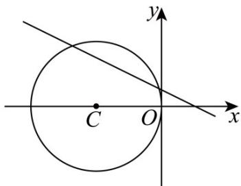

> [!faq]- 《专题2_5_直线与圆_圆与圆的位置关系_高效培优讲义_》官方解析
>
> > [!success]- **【答案】** B
>
> > [!note]- **【解析】**
> > 对于 A 项，整理直线 $l:(m+1)x+2y-1+m=0(m\in\mathbf{R})$
> >
> > 可得出 $m(x + 1) + x + 2y - 1 = 0$
> >
> > 解方程组 $\left\{\begin{aligned}x+1&=0\\ x+2y&-1=0\end{aligned}\right.$ 可得 $\left\{\begin{aligned}x&=-1\\ y&=1\end{aligned}\right.$ ，直线 l 过定点 $A(-1,1)$ .
> >
> > 圆 $C:(x+2)^{2}+y^{2}=4$ 的圆心为 $C(-2,0)$ ，半径为 r=2，
> >
> > 则 $|AC| = \sqrt{(-2 + 1)^2 + (0 - 1)^2} = \sqrt{2} < 2$
> >
> > 所以点 A 在圆内，即直线 l 过圆内一定点，
> >
> > 所以，直线 l 与圆 C 一定相交，不可能相切·故 A 正确；
> >
> > 
> >
> > 对于 B 项，当 m=0 时，直线 l 化为 $x+2y-1=0$ .
> >
> > 此时有圆心 $C(-2,0)$ 到直线l的距离 $d=\frac{|-2\times1-1|}{\sqrt{1^{2}+2^{2}}}=\frac{3\sqrt{5}}{5}$ ，且1<d<2，
> >
> > 因此圆 C 上只有两个点到直线 l 的距离等于 $^{1}$ -故 B 错误；
> >
> > 对于 C 项，圆 $x^{2} + y^{2} - 2x + 8y + 8 = 0$ 可化为 $(x - 1)^{2} + (y + 4)^{2} = 9$
> >
> > 圆心为 $M(1,-4)$ ，半径为 R=3。
> >
> > 因为 $\left|MC\right|=5=r+R$ ，所以两圆外切，
> >
> > 即恰有三条直线与圆 C 和圆 $x^{2} + y^{2} - 2x + 8y + 8 = 0$ 都相切，故 C 正确；
> >
> > 对于 $\mathbb{D}$ 项，因为 $(m + 1)\times 2 - 2(m + 1) = 0$
> >
> > 所以直线 l 与直线 $2x - (m + 1)y = 0$ 垂直，故 D 项正确.
> >
> > 故选 **B**
