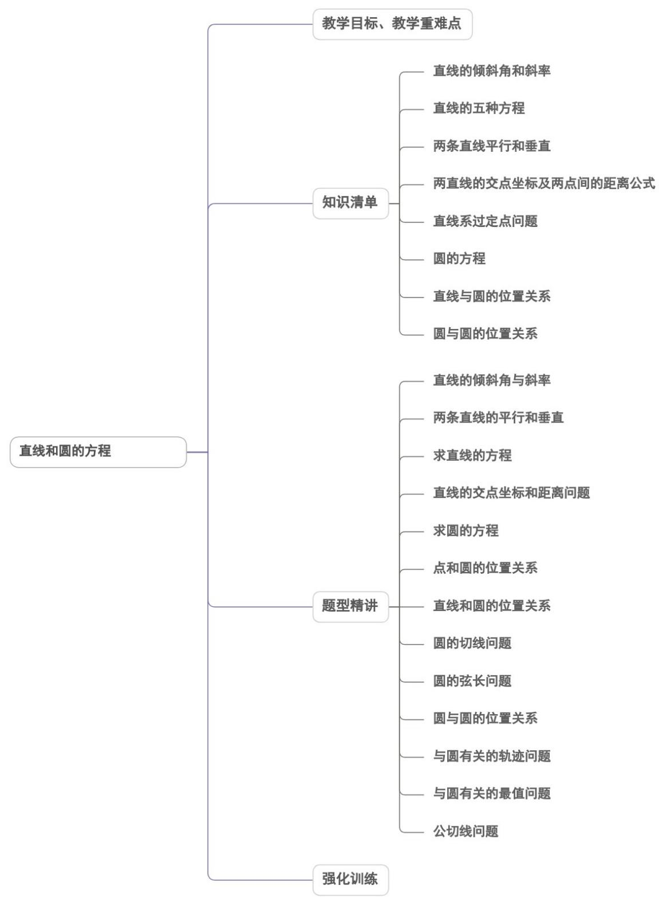

<!-- source-part:1 pages:1-50 -->

## 第二章 直线和圆的方程

## 内容概览

# 教学目标、教学重难点

<table><tr><td>教学目标</td><td>1.在平面直角坐标系中,结合具体图形,探索确定直线位置的几何要素.2.理解直线的倾斜角和斜率的概念,经历用代数方法刻画直线斜率的过程,掌握过两点的直线斜率的计算公式.3.能根据斜率判定两条直线平行或垂直4.根据确定直线位置的几何要素,探索并掌握直线方程的几种形式(点斜式、两点式及一般式),体会斜截式与一次函数的关系.5.能用解方程组的方法求两直线的交点坐标.6.探索并掌握两点间的距离公式.7.探索并掌握点到直线的距离公式.8.会求两条平行直线间的距离.9.能根据给定圆的方程,判断圆与圆的位置关系.</td></tr><tr><td>教学重难点</td><td>1.重点能用直线和圆的方程解决一些简单的问题.体会用代数方法处理几何问题的思想2.难点确定圆的几何要素,在平面直角坐标系中,探索并掌握圆的标准方程与一般方程.</td></tr></table>

![[高中/课堂同步/题库/人教A版高中数学同步讲义(2026)/03_选择性必修第一册/第二章 直线和圆的方程/讲义/第二章_直线和圆的方程_高效培优讲义_/知识清单_sec_01/知识清单_sec_01.md]]
![[高中/课堂同步/题库/人教A版高中数学同步讲义(2026)/03_选择性必修第一册/第二章 直线和圆的方程/讲义/第二章_直线和圆的方程_高效培优讲义_/知识点_01_直线的倾斜角和斜率_sec_02/知识点_01_直线的倾斜角和斜率_sec_02.md]]
![[高中/课堂同步/题库/人教A版高中数学同步讲义(2026)/03_选择性必修第一册/第二章 直线和圆的方程/讲义/第二章_直线和圆的方程_高效培优讲义_/即学即练_sec_03/即学即练_sec_03.md]]
![[高中/课堂同步/题库/人教A版高中数学同步讲义(2026)/03_选择性必修第一册/第二章 直线和圆的方程/讲义/第二章_直线和圆的方程_高效培优讲义_/知识点_03_两条直线平行和垂直_sec_04/知识点_03_两条直线平行和垂直_sec_04.md]]
![[高中/课堂同步/题库/人教A版高中数学同步讲义(2026)/03_选择性必修第一册/第二章 直线和圆的方程/讲义/第二章_直线和圆的方程_高效培优讲义_/知识点_05_直线系过定点问题_sec_05/知识点_05_直线系过定点问题_sec_05.md]]
![[高中/课堂同步/题库/人教A版高中数学同步讲义(2026)/03_选择性必修第一册/第二章 直线和圆的方程/讲义/第二章_直线和圆的方程_高效培优讲义_/知识点_06_圆的方程_sec_06/知识点_06_圆的方程_sec_06.md]]
![[高中/课堂同步/题库/人教A版高中数学同步讲义(2026)/03_选择性必修第一册/第二章 直线和圆的方程/讲义/第二章_直线和圆的方程_高效培优讲义_/即学即练_sec_07/即学即练_sec_07.md]]
![[高中/课堂同步/题库/人教A版高中数学同步讲义(2026)/03_选择性必修第一册/第二章 直线和圆的方程/讲义/第二章_直线和圆的方程_高效培优讲义_/知识点_07_直线与圆的位置关系_sec_08/知识点_07_直线与圆的位置关系_sec_08.md]]
![[高中/课堂同步/题库/人教A版高中数学同步讲义(2026)/03_选择性必修第一册/第二章 直线和圆的方程/讲义/第二章_直线和圆的方程_高效培优讲义_/知识点_08_圆与圆的位置关系_sec_09/知识点_08_圆与圆的位置关系_sec_09.md]]
![[高中/课堂同步/题库/人教A版高中数学同步讲义(2026)/03_选择性必修第一册/第二章 直线和圆的方程/讲义/第二章_直线和圆的方程_高效培优讲义_/题型精讲_sec_10/题型精讲_sec_10.md]]
![[高中/课堂同步/题库/人教A版高中数学同步讲义(2026)/03_选择性必修第一册/第二章 直线和圆的方程/讲义/第二章_直线和圆的方程_高效培优讲义_/题型01_直线的倾斜角与斜率_sec_11/题型01_直线的倾斜角与斜率_sec_11.md]]
![[高中/课堂同步/题库/人教A版高中数学同步讲义(2026)/03_选择性必修第一册/第二章 直线和圆的方程/讲义/第二章_直线和圆的方程_高效培优讲义_/题型02_两条直线的平行和垂直_sec_12/题型02_两条直线的平行和垂直_sec_12.md]]
![[高中/课堂同步/题库/人教A版高中数学同步讲义(2026)/03_选择性必修第一册/第二章 直线和圆的方程/讲义/第二章_直线和圆的方程_高效培优讲义_/题型03_求直线的方程_sec_13/题型03_求直线的方程_sec_13.md]]
![[高中/课堂同步/题库/人教A版高中数学同步讲义(2026)/03_选择性必修第一册/第二章 直线和圆的方程/讲义/第二章_直线和圆的方程_高效培优讲义_/题型04_直线的交点坐标和距离问题_sec_14/题型04_直线的交点坐标和距离问题_sec_14.md]]
![[高中/课堂同步/题库/人教A版高中数学同步讲义(2026)/03_选择性必修第一册/第二章 直线和圆的方程/讲义/第二章_直线和圆的方程_高效培优讲义_/题型05_求圆的方程_sec_15/题型05_求圆的方程_sec_15.md]]
![[高中/课堂同步/题库/人教A版高中数学同步讲义(2026)/03_选择性必修第一册/第二章 直线和圆的方程/讲义/第二章_直线和圆的方程_高效培优讲义_/题型06_直线和圆的位置关系_sec_16/题型06_直线和圆的位置关系_sec_16.md]]
![[高中/课堂同步/题库/人教A版高中数学同步讲义(2026)/03_选择性必修第一册/第二章 直线和圆的方程/讲义/第二章_直线和圆的方程_高效培优讲义_/题型07_圆的切线问题_sec_17/题型07_圆的切线问题_sec_17.md]]
![[高中/课堂同步/题库/人教A版高中数学同步讲义(2026)/03_选择性必修第一册/第二章 直线和圆的方程/讲义/第二章_直线和圆的方程_高效培优讲义_/题型08_圆的弦长问题_sec_18/题型08_圆的弦长问题_sec_18.md]]
![[高中/课堂同步/题库/人教A版高中数学同步讲义(2026)/03_选择性必修第一册/第二章 直线和圆的方程/讲义/第二章_直线和圆的方程_高效培优讲义_/题型09_圆与圆的位置关系_sec_19/题型09_圆与圆的位置关系_sec_19.md]]
![[高中/课堂同步/题库/人教A版高中数学同步讲义(2026)/03_选择性必修第一册/第二章 直线和圆的方程/讲义/第二章_直线和圆的方程_高效培优讲义_/题型10_与圆有关的轨迹问题_sec_20/题型10_与圆有关的轨迹问题_sec_20.md]]
![[高中/课堂同步/题库/人教A版高中数学同步讲义(2026)/03_选择性必修第一册/第二章 直线和圆的方程/讲义/第二章_直线和圆的方程_高效培优讲义_/题型11_与圆有关的最值问题_sec_21/题型11_与圆有关的最值问题_sec_21.md]]
![[高中/课堂同步/题库/人教A版高中数学同步讲义(2026)/03_选择性必修第一册/第二章 直线和圆的方程/讲义/第二章_直线和圆的方程_高效培优讲义_/题型12_公切线问题_sec_22/题型12_公切线问题_sec_22.md]]
![[高中/课堂同步/题库/人教A版高中数学同步讲义(2026)/03_选择性必修第一册/第二章 直线和圆的方程/讲义/第二章_直线和圆的方程_高效培优讲义_/强化训练_sec_23/强化训练_sec_23.md]]
